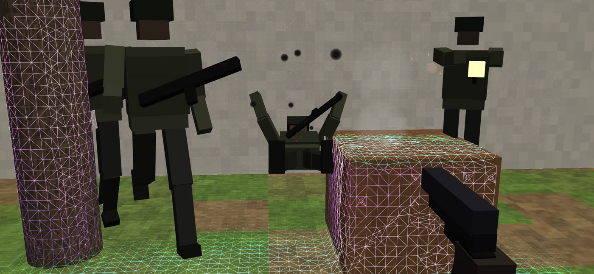
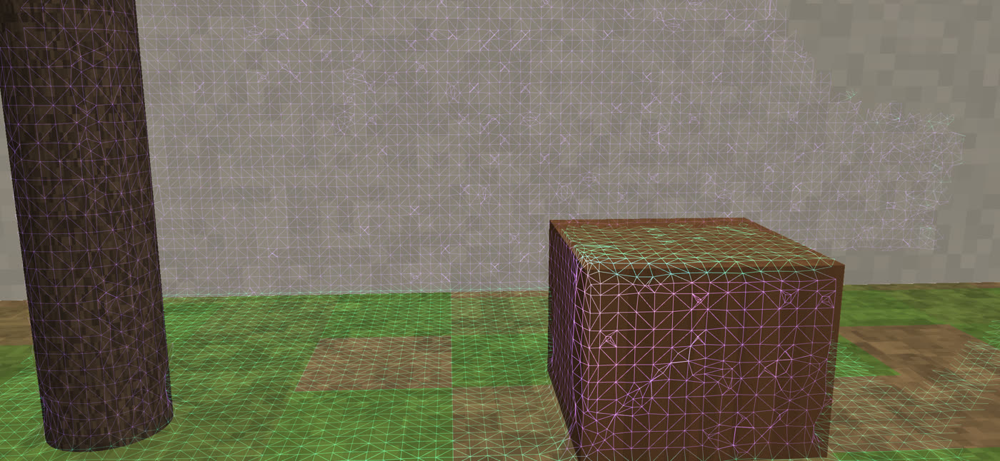
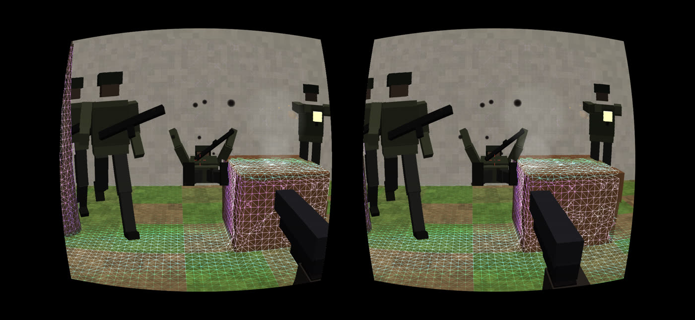

# Asalto MR — el shooter de realidad mixta del TikTok, en ARCore

Recreación del video de [@virtualgovr](https://vm.tiktok.com/ZN8rUTM9S/)
("Taking Down Enemies — Quest 3S"): soldados que corren por tu patio de
verdad, se paran a tirarte y, cuando les pegás, salen volando para atrás y caen
de espaldas sobre el piso real. Acá con un teléfono Android + ARCore, en
pantalla o en un visor tipo Cardboard (SBS).

```
./construir.sh          → salida/asalto-mr.apk  (~360 KB)
./pruebas/correr.sh     → pruebas del escaneo y del juego (en la PC)
node pruebas/shaders.mjs → compila los 12 shaders con WebGL
./pruebas/vista.sh      → capturas de la vista previa (salida/vista-*.png)
```

| juego | escaneo | SBS (visor) |
|---|---|---|
|  |  |  |

Las capturas son de la **vista previa en la PC**: la malla es la que sale del
escaneo de verdad (Tsdf + Mallador sobre una escena de prueba filmada con una
cámara de profundidad simulada, con ruido), los soldados y la pistola son las
cajas que dibuja `Figuras.java` de verdad, y todo pasa por los mismos shaders
de la app. El "patio" de fondo es la escena de prueba dibujada por trazado de
rayos (en el teléfono es la cámara).

## El escaneo: polígonos, no "mesas y sillas"

No usa la detección de planos de ARCore para el juego (sólo como respaldo del
piso). Usa la **Depth API** (profundidad cruda + su confianza) y arma una malla
de todo lo que hay, como la malla de escena del Quest:

1. **Volumen de voxeles (TSDF)** — `Tsdf.java`. Cada imagen de profundidad son
   ~19.000 rayos: lo que queda antes del punto medido está libre, lo que queda
   justo detrás está ocupado. Se promedian muchas imágenes. Voxel de 5, 7 o
   10 cm (configurable), bloques de 16³, hasta 5.5 m (más lejos el ruido de
   ARCore crece con la distancia²). Borra "fantasmas" de cosas que se movieron.
2. **Malla (surface nets)** — `Mallador.java`. Un vértice por celda donde la
   superficie cruza, un cuadrilátero por arista: polígonos parejos, cerrados,
   bloque por bloque y sin costuras.
3. En un **hilo aparte** (`Escaneo.java`): la cámara nunca espera al escaneo.

La malla hace cuatro cosas:
- **oclusión**: lo real tapa a lo virtual (un soldado detrás de un árbol o de
  una mesa no se ve — mirá la captura);
- es el **piso** por donde caminan los soldados, lo que **esquivan** (troncos,
  paredes, muebles) y donde **pegan las balas** (chispas y polvo en la
  superficie real);
- el **efecto de escaneo**: las líneas de los polígonos, verde-agua lo
  horizontal y violeta lo vertical, con una onda que sale de vos cada 3 s;
- en SBS, el **entorno reproyectado**: la malla pintada con la imagen de la
  cámara, vista desde cada ojo, para que lo real también tenga profundidad.

### Lo medido (en la PC, escena sintética con ruido tipo ARCore)

| | |
|---|---|
| error medio de la malla | **1.2 cm** |
| vértices a más de un voxel (7 cm), a menos de 4 m | **0.2 %** |
| suelo bajo un punto / sobre la mesa | 0.1 cm / 0.0 cm de error |
| rayo a la mesa / al tronco | 1 mm / 6 mm de error |
| integrar una imagen 160×120 (PC) | ~20 ms (en el teléfono, 1 de cada 2 píxeles) |

`PruebaJuego`: los soldados caminan sobre el piso escaneado (0 de 1528 pasos
fuera), ninguno se mete en la mesa, el tronco o la pared, de un tiro caen para
atrás y quedan de espaldas sobre el piso real, el tiro a la mesa pega en la cara
correcta, la cabeza cuenta como cabeza, el cargador se recarga, las oleadas
avanzan.

## Cómo se juega

- **Escaneá** primero: mirá el piso y alrededor moviéndote despacio. Cuando
  hay piso y malla suficiente dice "Listo": tocá para empezar (en el visor
  arranca solo a los 3 s).
- **Disparar**: tocar la pantalla (o el botón del visor, que toca la
  pantalla), **volumen +/−**, un control Bluetooth (A, R1, R2) o un disparador
  de selfie. Se apunta con la mira del centro (con la cabeza, en el visor).
  **Recargar**: X o B del control (o sola, al vaciar el cargador).
- Si aguantás 4 s sin que te den, te vas curando. La dificultad cambia cuánto
  apuntan, cuánto pegan y lo rápido que corren.

## SBS (visor) y su configuración

Botón **SBS** (o Ajustes → Modo). Se sale con **Atrás**. En Ajustes:

| ajuste | qué hace |
|---|---|
| Entorno en SBS | **Plano**: la imagen de la cámara igual en los dos ojos (lo virtual sí tiene profundidad). **3D**: el entorno reproyectado con la malla en cada ojo |
| Distancia entre ojos (IPD) | separación de las cámaras virtuales (63 mm por defecto) |
| Centro de los lentes | dónde caen los centros de los lentes en la pantalla (en mm reales, con los dpi del teléfono) |
| Tamaño de la imagen | cuánto de cada mitad ocupa (achicar = ver más de golpe) |
| Corregir lentes, k1, k2 | deforma en barril para compensar los lentes (k1 0.22, k2 0.12 para un Cardboard típico) |
| Ojos cambiados | para mirar cruzado sin visor |

El HUD (puntos, vida, balas, mira, borde rojo al recibir) se dibuja en
OpenGL para que salga en los dos ojos.

## La cámara ultra angular: lo que se puede y lo que no

- **Lo que se puede** ("Más ancha", por defecto): ARCore ofrece varias
  configuraciones de la cámara trasera. La 16:9 recorta el sensor; la 4:3 lo
  usa entero. La app mide el campo visual de cada una (focal y tamaño del
  sensor de Camera2) y elige la de más campo; si el teléfono tiene sensor ToF,
  lo prefiere. El campo que quedó sale en Ajustes.
- **Lo que es un intento** ("Ultra angular", experimental): ARCore sólo corre
  sobre la cámara que tiene calibrada (la principal) y no deja elegir la ultra
  angular. La app abre la cámara en **modo compartido** y le pide a Camera2
  **zoom < 1×** (`CONTROL_ZOOM_RATIO`), que en los teléfonos que lo permiten
  cambia al lente ultra angular del mismo módulo. En Ajustes dice qué pasó
  ("pedido zoom 0.6×" o "tu teléfono no baja de 1×"). Si el teléfono lo acepta,
  la imagen se ve más ancha **pero ARCore sigue creyendo que es la principal**:
  el seguimiento, la profundidad y la alineación de lo virtual pueden quedar
  mal. Si falla, vuelve solo a "Más ancha". Es un límite de ARCore, no algo
  que se arregle desde la app.

## Lo que NO se probó

- **En un teléfono.** Esta máquina no tiene uno. Está probado: el escaneo y
  el juego (pruebas en la PC), que los 12 shaders compilan y enlazan, el dibujo
  de soldados/pistola/malla/SBS/lentes (vista previa con el código real), y
  que el APK compila, firma y trae ARCore. **No** está probado: el camino con
  ARCore de verdad (la profundidad cruda, las poses, el modo compartido de la
  cámara), el rendimiento en el teléfono, ni el visor.
- La Depth API la tienen muchos teléfonos con ARCore, pero no todos. Sin ella
  no hay malla: se juega sobre los planos del piso y no hay oclusión.
- La correspondencia profundidad ↔ intrínsecos usa los de la textura escalados
  a la imagen de profundidad (como el ejemplo de profundidad cruda de ARCore).
  Si la malla sale corrida respecto de lo real, es lo primero a revisar.

## Seguridad

En el video el tipo juega **arriba de una moto** (y el propio video avisa
"no andes en moto en MR"). No lo hagas: con la cámara tapándote la vista
real, jugá parado o caminando despacio, en un lugar despejado.

## Archivos

| archivo | qué hace |
|---|---|
| `src/.../Tsdf.java` | el volumen de voxeles: integrar la profundidad, suelo, rayos, ocupado |
| `src/.../Mallador.java` | surface nets: de voxeles a polígonos |
| `src/.../Escaneo.java` | el hilo del escaneo |
| `src/.../Juego.java` | soldados, disparos, caídas, partículas, oleadas (sin Android) |
| `src/.../Principal.java` | la actividad: ARCore, profundidad, entrada, dibujo por ojo |
| `src/.../Camara.java` | elegir la cámara más ancha; el intento de ultra angular |
| `src/.../MallaGl.java` | la malla en la GPU: oclusión, líneas, sólida, reproyectada |
| `src/.../Figuras.java` | soldados, pistola, partículas, trazadoras |
| `src/.../Hud.java` · `Lentes.java` | el HUD en GL; la corrección de lentes |
| `src/.../Ajustes.java` · `Panel.java` | la configuración y su panel |
| `src/.../Sonido.java` | los sonidos, sintetizados al arrancar |
| `pruebas/PruebaEscaneo.java` · `PruebaJuego.java` | las pruebas en la PC |
| `pruebas/shaders.mjs` · `vista.mjs` · `vista/` | shaders con WebGL; la vista previa |
| `construir.sh` | arma el APK sin Gradle (caché compartida con mundo-ar) |
