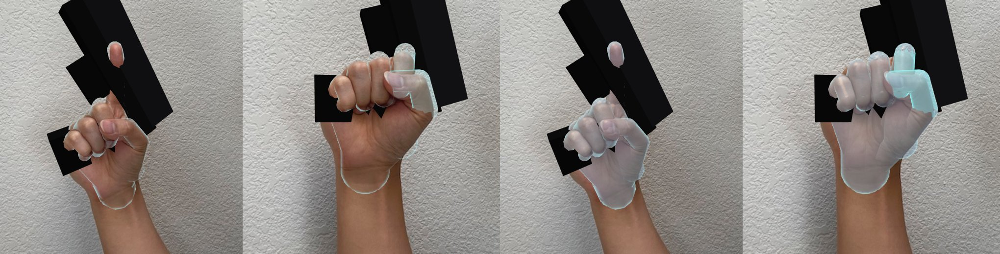
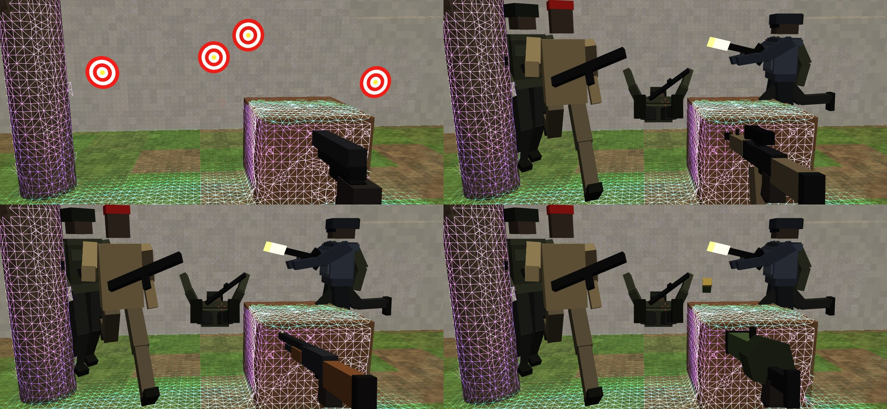
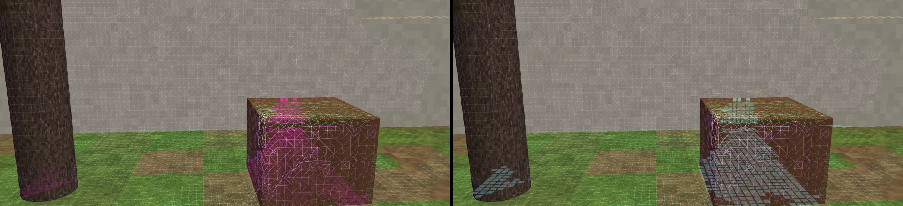

# Asalto MR — el shooter de realidad mixta del TikTok, en ARCore

Recreación del video de [@virtualgovr](https://vm.tiktok.com/ZN8rUTM9S/)
("Taking Down Enemies — Quest 3S"): soldados que corren por tu patio de
verdad, se paran a tirarte y, cuando les pegás, salen volando para atrás y caen
de espaldas sobre el piso real. Acá con un teléfono Android + ARCore, en
pantalla o en un visor tipo Cardboard (SBS).

```
./construir.sh          → salida/asalto-mr.apk  (~18 MB: incluye MediaPipe y el modelo de manos)
./pruebas/correr.sh     → pruebas del escaneo, del mapa de la IA y del juego (en la PC)
node pruebas/shaders.mjs → compila los 13 shaders con WebGL
./pruebas/vista.sh      → capturas de la vista previa (salida/vista-*.png)
python3 pruebas/manos-camara.py → cámara YUV → RGB → modelo de manos, con fotos reales (pide pip install mediapipe)
```

| juego | escaneo | SBS (visor) |
|---|---|---|
|  |  |  |

| el mapa de la IA: lo visto y lo que completó | zonas y rutas en el piso |
|---|---|
|  |  |

| la mano "Meta" sobre fotos reales: tu mano real ADELANTE del arma (los dedos tapan el mango) y encima el borde fantasma que brilla; apretando, se enciende la punta del índice · a la derecha, la versión "vidrio" (visor con el entorno en 3D) |
|---|
|  |

| las 4 armas: pistola (con los blancos de la práctica pegados a la pared escaneada) · fusil · escopeta · lanzagranadas (con una granada en vuelo) — y los soldados rápido (arena, boina roja) y pesado (blindado) |
|---|
|  |

Las capturas son de la **vista previa en la PC**: la malla es la que sale del
escaneo de verdad (Tsdf + Mallador sobre una escena de prueba filmada con una
cámara de profundidad simulada, con ruido), los soldados y la pistola son las
cajas que dibuja `Figuras.java` de verdad, y todo pasa por los mismos shaders
de la app. El "patio" de fondo es la escena de prueba dibujada por trazado de
rayos (en el teléfono es la cámara).

## El escaneo: polígonos, no "mesas y sillas"

No usa la detección de planos de ARCore para el juego (sólo como respaldo del
piso). Usa la **Depth API** (profundidad cruda + su confianza) y arma una malla
de todo lo que hay, como la malla de escena del Quest:

1. **Volumen de voxeles (TSDF)** — `Tsdf.java`. Cada imagen de profundidad son
   ~19.000 rayos: lo que queda antes del punto medido está libre, lo que queda
   justo detrás está ocupado. Se promedian muchas imágenes. Voxel de 5, 7 o
   10 cm (configurable), bloques de 16³, hasta 5.5 m (más lejos el ruido de
   ARCore crece con la distancia²). Borra "fantasmas" de cosas que se movieron.
2. **Malla (surface nets)** — `Mallador.java`. Un vértice por celda donde la
   superficie cruza, un cuadrilátero por arista: polígonos parejos, cerrados,
   bloque por bloque y sin costuras.
3. En **dos hilos aparte** (`Escaneo.java`): uno integra la profundidad y
   otro arma la malla, el mapa y los huecos. La cámara nunca espera al
   escaneo, y la malla ya no frena la integración.

**Más rápido, igual de preciso**: los bloques se buscan en una tabla propia
(sin cajas de Java ni `HashMap`), y lo lejano se integra con menos rayos (a
3 m un voxel de 7 cm lo cubren muchos píxeles: se usa 1 de cada k, con k
según la distancia; cerca, todos). En la PC, con la misma escena: armar la
malla de 123 bloques **24.9 → 10.0 ms**, integrar una imagen **6.5 → 5.4 ms**;
el error de la malla no cambió (tabla de abajo).

La malla hace cuatro cosas:
- **oclusión**: lo real tapa a lo virtual (un soldado detrás de un árbol o de
  una mesa no se ve — mirá la captura);
- es el **piso** por donde caminan los soldados, lo que **esquivan** (troncos,
  paredes, muebles) y donde **pegan las balas** (chispas y polvo en la
  superficie real);
- el **efecto de escaneo**: las líneas de los polígonos, verde-agua lo
  horizontal y violeta lo vertical, con una onda que sale de vos cada 3 s;
- en SBS, el **entorno reproyectado**: la malla pintada con la imagen de la
  cámara, vista desde cada ojo, para que lo real también tenga profundidad.

### Lo medido (en la PC, escena sintética con ruido tipo ARCore)

| | |
|---|---|
| error medio de la malla | **1.2 cm** |
| vértices a más de un voxel (7 cm), a menos de 4 m | **0.2 %** |
| suelo bajo un punto / sobre la mesa | 0.1 cm / 0.0 cm de error |
| rayo a la mesa / al tronco | 1 mm / 6 mm de error |
| integrar una imagen 160×120 (PC) | ~20 ms (en el teléfono, 1 de cada 2 píxeles) |

`PruebaJuego`: los soldados caminan sobre el piso escaneado (0 de 1528 pasos
fuera), ninguno se mete en la mesa, el tronco o la pared, de un tiro caen para
atrás y quedan de espaldas sobre el piso real, el tiro a la mesa pega en la cara
correcta, la cabeza cuenta como cabeza, el cargador se recarga, las oleadas
avanzan.

## La pistola en la mano (hand tracking)

La cámara ve tu mano, y la pistola va **en tu mano de verdad**, como en el
video. Un mismo cuadro de la cámara que usa ARCore pasa por **MediaPipe Hand
Landmarker** (el modelo de manos de Google, `hand_landmarker.task`, dentro
del APK), en su propio hilo. De ahí salen 21 puntos por mano, hasta dos manos
(una pistola en cada una).

- **Empuñá** como si tuvieras la pistola: medio, anular y meñique cerrados,
  el índice estirado.
- **Disparar = apretar el gatillo**: cerrás el índice. También vale la
  "pistolita": índice estirado y bajar el pulgar.
- **Recargar**: la mano abierta medio segundo.
- **Apuntar**: con la mano. Un láser rojo va del caño hasta donde pega en la
  malla. Tocar la pantalla o el volumen también disparan, desde la pistola de
  la mano.
- **Cambiar de arma**: la **V** (índice y medio estirados, anular y meñique
  cerrados) medio segundo. Pasa a la siguiente: pistola → fusil → escopeta →
  lanzagranadas.
- **El fusil es automático**: tira mientras tengas el gatillo apretado (el
  índice cerrado), igual que con el dedo apoyado en la pantalla o el volumen
  apretado.
- **Sin mano a la vista**: el arma vuelve a la vista, como antes.

### La mano "Meta": tu mano real, transparente (como Aeroplaza)

La mano se dibuja como en un Meta Quest (igual que Aeroplaza, portado de su
shader). Cada hueso es una **cápsula** con el radio de su articulación, y el
fresnel deja casi sólo el **borde que brilla**: tu mano de verdad se sigue
viendo en la cámara, con el contorno encima. Las puntas del pulgar y del
índice se encienden al apretar el gatillo.

Además, la mano escribe su **profundidad** antes de lo virtual:
- lo que queda detrás de tu mano no se dibuja, así tu mano real queda
  **adelante** de los soldados;
- lo hace otra vez antes del arma, así **los dedos tapan el mango** y el arma
  queda agarrada, no pegada encima.

En el visor, con el entorno en 3D (la cámara proyectada sobre la malla), la
mano de verdad no se ve bien, así que ahí la mano es más sólida ("vidrio").

Aparece en 80 ms y se va en 200 ms, con las reglas de Aeroplaza para darla
por perdida (4 imágenes sin verla, o 2 y un cuarto de segundo). Si el
teléfono no tiene `GL_OES_standard_derivatives`, el borde va sin el
suavizado de un píxel. En Ajustes → Hand tracking: "Sí (mano fantasma)" o
"Sí + esqueleto".

### ARCore como Aeroplaza

- **La cámara**: la de más campo visual. De sus configuraciones, la de **más
  fps** (60 si hay, así la mano se sigue el doble de seguido) y la imagen más
  cerca de **640×480**. El juego necesita profundidad para la malla, así que
  se queda con la primera, en ese orden, que la tenga (Ajustes → Cámara →
  "Más ancha", por defecto).
- `UpdateMode.LATEST_CAMERA_IMAGE`, foco `AUTO`, sin estimar la luz.
- **La hora de la foto** es la de la cámara (`Frame.getTimestamp`), no la del
  cuadro que se dibuja: así el adelanto compensa lo que de verdad tardó.
- **Tu mano no se escanea**: donde está la mano, la profundidad no entra al
  escaneo. Antes quedaban manchas de mano en la malla. Esto no está en
  Aeroplaza.

### Apuntar adelante: el rayo del ojo por la mano

Con la cámara detrás de la mano, apuntar adelante es apuntar **a lo largo del
rayo de la cámara**, justo lo que una sola cámara mide peor: la red estima la
profundidad de cada punto de la mano con la forma de su modelo, la mano sale
achatada y "de la muñeca a los nudillos" queda **de costado** (el arma
apuntaba a la izquierda con la mano apuntando al fondo).

Ahora el caño va **del punto de mira por la mano**, como apunta la gente: el
ojo, la mano y el blanco en línea (el modelo "ojo–dedo", el que menos erra en
los estudios de apuntar en el aire). Con el teléfono en la mano "el ojo" es la
cámara (lo que ves en la pantalla); en el visor, 5 cm detrás. Lo que la red
erra en la distancia de la mano la mueve **a lo largo de ese mismo rayo**: la
puntería no se mueve. La corredera sigue el giro de tu muñeca (da la vuelta
entera igual). Y la profundidad de ARCore ahora corrige la distancia de la
mano rápido (la mediana de las últimas 9 medidas que coinciden, no de 41).

- **Calibrar la puntería** (menú o Ajustes): aparecen 3 blancos, **sin
  láser**; apuntale a cada uno con el arma como apuntás vos y disparale. Se
  aprende cuánto más abajo y al costado de la vista tenés el arma (cada uno la
  sostiene distinto) y se guarda, uno para el teléfono en la mano y otro para
  el visor.
- **Ayuda para apuntar**: si un soldado está a menos de 2.5° del caño y no hay
  nada real en el medio, el tiro va a él.
- Ajustes → "Apuntar con": el rayo (de fábrica) o la muñeca (como antes).

`PruebaApuntar`: la mano apuntando a 9 lados (adelante, costados, arriba,
abajo, a la vista de la cámara), con la red **achatando la mano a la mitad**,
dos personas (el arma justo debajo de la vista; la mano baja y a la derecha
como en la captura):

| | con la muñeca (antes) | el rayo sin calibrar | el rayo calibrado |
|---|---|---|---|
| apuntar adelante | 6.8° | 3.8° | **0.7°** |
| promedio / peor | 9.0° / 16° | hasta 15° (la mano baja) | **1.0° / 1.7°** |

La calibración encuentra dónde tenés el arma a ±1 cm con 3 blancos.

### El arma gira 360° sin soltarse ni darse vuelta

Antes el arma se veía en la mano sólo en las imágenes en que la red decía
"empuña". Girando la muñeca, apuntando al techo o de costado, la mano se ve
de canto o de punta y la red da los dedos cualquiera: el arma **parpadeaba**
(se iba a la pantalla y volvía). Ahora se **agarra** con 2 imágenes
empuñando y se **suelta** sólo con la mano abierta (o la V) 5 imágenes
seguidas, o si se deja de ver la mano. El giro ya se filtraba como un
cuaternión (sin ángulos que se traben), así que da la vuelta entera.

`PruebaGiro360` (la mano con el ruido de siempre y además 10 % de imágenes
malas, hasta 45 % de canto: dedos cualquiera o una mano "abierta" falsa):

| movimiento | caño (promedio · peor) | se dio vuelta | sin arma: antes → ahora |
|---|---|---|---|
| la muñeca 360° alrededor del caño | 5.1° · 44° | 0 cuadros | 2.3 % → **0 %** |
| del piso al techo (±85°) | 1.9° · 14° | 0 | 5.7 % → **0 %** |
| de costado a costado (±100°) | 1.9° · 17° | 0 | 4.1 % → **0 %** |
| vos das una vuelta entera (180°/s) | 1.4° · 5° | 0 | 9.4 % → **0 %** |
| todo junto | 3.4° · 31° | 0 | 4.9 % → **0 %** |

(El "peor" es girando rápido: la foto llega 60 ms tarde.) Lo que sigue sin
poderse: apuntar **atrás tuyo** con el brazo estirado, porque la cámara no
ve la mano. Ahí vale el control Bluetooth (abajo): girás el cuerpo y tirás
con la mira.

### Súper fija: el filtro de la mano (como Aeroplaza)

La versión anterior temblaba y saltaba. Tres cosas la hacían andar mal:
- mezclaba la profundidad de ARCore **en cada cuadro**, y en la mano esa
  profundidad se mezcla con el fondo y salta decenas de centímetros;
- achicaba la imagen a 320×240;
- sacaba la distancia del tamaño de la mano en cada cuadro, que para el
  modelo cambia ±10 %.

Ahora hace lo mismo que el hand tracking de **Aeroplaza** (mismo modelo, mismo
`hand_landmarker.task`: lo que cambia es cómo se usa). Lo saqué de su APK y
lo porté a `FiltroMano.java`:

- **La imagen entera** (640×480) y la **GPU** (si no anda, la CPU). Una red
  para **una mano** mientras se ve una sola, y cada 1.2 s una pasada con la de
  dos. Sin tope de imágenes por segundo.
- **Ganancia**: se mide el brillo dentro de la caja de la mano y se aclara la
  imagen hasta ×6 (a contraluz o en la sombra la mano se perdía).
- **Cada punto sobre su rayo** de la foto (lo lateral lo mide bien la imagen)
  a la profundidad de la forma del modelo.
- **El tamaño se aprende**: cada cuadro se reescala a ese tamaño desde la
  cámara, así la distancia no tiembla. La profundidad de ARCore sólo
  **calibra el tamaño real de tu mano**, despacio: con la mediana de muchas
  imágenes, y sólo cuando coincide en 3 puntos de la palma.
- **La palma es rígida**: se filtran su centro y su giro, y no los 21 puntos
  sueltos. El centro va separado por ejes: la profundidad, que es lo que
  tiembla con una sola cámara, filtra más que lo lateral. Los **dedos**
  van aparte, en el marco de la palma, con la forma de la palma y el largo de
  los huesos aprendidos. **Cerrar el gatillo no mueve el arma.**
- **Saltos**: un salto de profundidad de más de 8 cm (contra lo esperado y
  contra la mediana) se descarta. Un salto de más de 25 cm sólo vale si lo
  confirman 3 imágenes seguidas (Aeroplaza lo tomaba de una). Los cuadros "en
  espejo" (adelante/atrás confundidos) se corrigen.
- **Quieta es quieta**: el centro se ancla si no sale de 5 mm por un cuarto
  de segundo. Y un **ancla de giro** que no está en Aeroplaza (ellos apuntan
  con pellizcos; para un arma, medio grado a 5 m son 4 cm): si el caño no sale
  de 1.5° por un cuarto de segundo, se fija, y se suelta en cuanto lo movés.
- **Predicción** (la de Aeroplaza, entera): la imagen llega tarde (lo que
  tarda la red). Se adelanta hasta el cuadro que se dibuja, a lo sumo 6.5 cm,
  con una **ganancia aprendida**: compara lo que predijo con lo que pasó.
  Lateral y profundidad van aparte. Adelanta menos si se mueven los dedos y
  no la mano, y "sigue de largo" si la mano se va por el borde de la foto.
- **El resorte**: cuando llega una imagen, la salida no salta. La diferencia
  se apaga como un resorte (32 ms quieta, 20 ms moviéndose). Con fotos a 30 y
  dibujo a 60, la mano se mueve pareja: **8 veces menos tirones** (a cambio de
  unos milímetros de demora). Después se **endereza**: la palma y los huesos
  vuelven a su forma aprendida.
- **Cuál mano es cuál**: por dónde tendría que estar cada una ahora (el
  centro predicho en 3D), con una zona que crece si hace rato que no se ve.
  - Dos detecciones a menos de 4 cm son la misma mano.
  - Una mano nueva, con otra ya a la vista, tiene que aparecer 2 veces
    seguidas: los fantasmas de la red de un cuadro no cuentan.
  - La misma mano vista dos veces en el mismo rayo tampoco cuenta.
- El gesto sale de los dedos ya corregidos. Y el disparo con el pulgar ("la
  pistolita") hay que armarlo levantando el pulgar primero: con una mano
  real de pulgar quieto en 0.46, pegado al umbral, disparaba solo.

Medido en `pruebas/PruebaFiltroMano.java`, antes contra ahora, con el mismo
ruido. La mano es real: los puntos que dio MediaPipe con una foto. Se mueve
delante de la cámara y se "mide" con un ruido parecido al del modelo:
- 0.8 px en la foto;
- el tamaño que cambia ±4 %;
- 3 % de cuadros en espejo y 2 % con el tamaño 25 % mal;
- la mano 8 % más grande de lo que supone el modelo;
- la profundidad de ARCore mezclada con el fondo el 35 % de las veces;
- 60 ms de demora.

| | antes | ahora |
|---|---|---|
| quieta: temblor del arma | 10.5 mm | **1.2 mm** |
| quieta: temblor del caño | 8.2° | **0.13°** |
| quieta: el punto del láser a 5 m | 133 cm | **3.5 cm** |
| distancia real (con la mano 8 % más grande) | 9 mm corrida | **5 mm** (ARCore calibró ×1.09; real ×1.08) |
| moviéndose a 0.5 m/s | 48 mm de error | **28 mm** |
| tirones cuadro a cuadro (la mano real: 0.52) | 20.9 mm/cuadro² | **2.65** |
| girando la muñeca ±35° | 13.1° | **6.4°** |
| apuntando despacio (6°/s) | 6.7° | **2.0°** (el ancla no lo pega) |
| apretar el gatillo 5 veces | el caño se va hasta 57° | **0.5°**; salen los 5 tiros |
| dos manos 5 s, en cualquier orden | — | 0 cambios de mano, 0 fantasmas |
| mano oscura (brillo 0.17) | — | ganancia ×2.4 → 0.42 |

Estos números son contra un ruido **simulado**: el de verdad del teléfono no
lo pude medir, porque no tengo uno acá. En el HUD sale qué usa la red
("mano (GPU ☀×1.8)"): si dice CPU o se ve lento, pasame eso.

Cómo está hecho lo demás (`Mano.java`, sin Android, probado en la PC):

- **La pose**: cuánto dobla cada dedo, con los puntos en metros. No depende
  de cómo esté girada la mano.
- **El gatillo**: se mide la distancia de la punta del índice a la muñeca, en
  palmas. En fotos reales: estirado 1.82, cerrado 0.90–0.93. Es mucho más
  estable que sumar ángulos de falanges de 2 cm. Va suavizado, con histéresis
  (se aprieta por debajo de 1.25 y se suelta por encima de 1.55) y un mínimo
  de 130 ms entre tiros. Solo dispara si venías empuñando con el índice
  estirado: agarrar de golpe no cuenta.
- **La pistola**: el caño apunta hacia donde van los nudillos, de la muñeca a
  los nudillos, sin la componente de la línea de nudillos, que es el mango.
  Al apretar el gatillo no se mueve. El mango va en el centro de la palma.
- **En 3D**: se busca dónde tiene que estar la mano (con la forma en metros
  del modelo) para que sus 21 puntos caigan justo sobre la foto (mínimos
  cuadrados). Si ARCore midió profundidad ahí y coincide, pesa más esa.
- **Pantalla al revés** (horizontal invertida): la imagen se gira 180° para
  el modelo y los puntos se desgiran.

Lo medido con **manos reales**: los puntos que da el modelo sobre fotos de
prueba públicas de MediaPipe (en `pruebas/manos.txt`, que genera
`pruebas/manos-extraer.py`).

| | |
|---|---|
| puño y pulgar arriba | "aprieta" (índice 209–219°) |
| índice apuntando, también girado | "empuña" (índice 43–47°) |
| la V · manos abiertas | "V" (cambiar de arma) · "abierta" |
| apuntar → puño, 3 veces con fotos reales | 3 tiros |
| agarrar de golpe desde la mano abierta · la V | 0 tiros |
| 10 veces apretar y soltar, con 3 mm de temblor | 10 tiros |
| dedo quieto a medio gatillo, temblando 4 mm, 5 s | 0 tiros |
| la pistola al apretar el gatillo | se mueve 0.00° |
| posición 3D (tamaño del modelo ±10 %, 2 px, 3 mm) | 35 mm solo con la imagen, **18 mm** con la profundidad de ARCore |
| cámara YUV → RGB (el código Java) → el modelo | colores a 1.5/255, la mano en el mismo lugar (≤ 0.5 px), girada igual (≈ 1 px) |

Y la vista previa de arriba: el esqueleto reproyectado desde el 3D cae sobre
los nudillos de la foto, y la pistola queda agarrada en el puño.

MediaPipe se arma sin Gradle (lo baja `construir.sh`: tasks-vision y
tasks-core 1.0.0, más guava, protobuf-javalite y flogger). Se le **saca la
telemetría**: la librería original manda estadísticas de uso a Google por
otra librería (datatransport). `mediapipe-parche/` la reemplaza por el logger
vacío que trae la propia MediaPipe, y esas 3 clases no van en el APK. Las
librerías nativas van solo para ARM (arm64, armv7). En x86, el hand tracking
dice "no disponible" y el resto anda.

## Escaneo completo, lo que no se ve, y la IA de zonas

### Escaneo completo (guiado)

Al empezar (o con Ajustes → "Escaneo completo") la app te guía hasta
escanear el lugar entero. Mira las **fronteras** (donde lo escaneado se corta
contra lo no visto) y te dice, en el HUD y en el minimapa:

- el **porcentaje de cobertura** (lo visto a menos de 6 m contra lo no visto
  que se llega desde una frontera, incluido lo que tenés atrás y a tus pies);
- **hacia dónde mirar**: "girá a la derecha →", "date vuelta", "mirá el piso
  cerca tuyo ↓", con una flecha magenta en el borde del minimapa;
- con **75 % o más** dice "Escaneo completo ✓" (en el visor arranca solo).

Los rayos de la profundidad ahora también guardan el **aire medido** (lo que
atravesaron). Con eso el mapa sabe dónde seguro no hay nada.

### Completar lo que no se ve

Ajustes → "Completar lo que no se ve". Sobre el mapa de zonas, cada celda no
vista toma lo que dicen sus vecinas, por pasadas:

- el **piso** se extiende hasta 2 m: debajo y detrás de las cosas, los huecos
  del escaneo;
- los **obstáculos** se completan por detrás hasta 50 cm (el fondo de la mesa
  y del tronco que nunca viste) y **todo obstáculo llega hasta el suelo**;
- lo que no tiene tapa vista (pared, árbol) sigue para arriba, no se le
  inventa un techo.

Hay tres reglas para no inventar cualquier cosa:
1. nunca contra aire medido: si un rayo pasó por ahí, ahí no hay nada;
2. en la sombra de algo alto y ancho (una pared) el piso entra solo 75 cm:
   detrás de un tronco se completa, detrás de una pared no se inventa un patio;
3. solo hasta 7 m: más lejos la profundidad es puro ruido.

Lo supuesto se escribe en el volumen como **inferido**. Sale en la malla en
**ámbar punteado** (lo real sigue verde y violeta), el juego lo usa (se camina
y se choca contra lo supuesto), y **cualquier medición de verdad lo
reemplaza**: si después lo ves, se corrige solo.

### Los huecos: la vista de sellado



*Izquierda: lo que hay que sellar (magenta), el piso debajo de la mesa y
detrás del tronco, visto a través de ellos. Derecha: ya sellado (celeste). Lo
dibuja `SellosGl.java` con su shader, sobre la malla escaneada de verdad.*

Un escaneo tiene agujeros: la pared detrás del sillón, el piso debajo de la
mesa o de la mochila, el pedazo de pared que la cámara nunca miró de frente.
`Sellador.java` los busca cada segundo (en el hilo de la malla) y los cierra:

1. **Las superficies planas**: de los voxeles de superficie medidos (no los
   supuestos) arma regiones con la misma normal (±20°) y a menos de 1.5
   voxeles del plano: paredes, piso, mesas. Las esquinas (mezclan dos
   normales) y las tiras no cuentan.
2. **Una grilla sobre cada plano**, de un voxel por celda. Cada celda es
   *vista*, *cerrada* (algo sólido justo delante: la esquina, la pata de la
   mesa), *tapada* (más adelante hay una superficie que mira para el plano:
   la tapa de la mesa sobre el piso, el frente del sillón delante de la pared),
   *aire* (un rayo pasó por el plano: se ve a través) o *no se sabe*.
3. **Hueco = lo que queda encerrado**: lo que no se alcanza desde el borde de
   la grilla sin cruzar celdas vistas o cerradas. Lo que toca el borde no es
   un hueco: es donde termina lo escaneado (eso lo guía el escaneo completo).
4. Cada hueco:
   - **abertura** (gris) si buena parte es aire medido: una ventana, una
     puerta abierta. **No se sella**;
   - **por sellar** (magenta, late) si es de hasta 1.5 m² (lo tapado, hasta
     6 m²: nunca se va a ver);
   - **falta escanear** (naranja, late) si es más grande: suponerlo sería
     inventar; la guía dice "Mirá el hueco naranja (2.1 m, a la izquierda)";
   - **sellado** (celeste, destella al cerrarse): se escribió el plano en el
     volumen como **supuesto** (sólo donde nadie midió, o se midió tan poco
     que la malla no lo cree). Si después lo mirás, lo medido lo reemplaza.

Ajustes → "Sellar los huecos": **Solos** (se sellan apenas aparecen), **Yo
desde el menú** (se ven y el menú dice "Sellar 3 huecos ahora") o No. Se ven
mientras escaneás (también lo que está detrás de algo, más tenue), en el HUD
("Huecos: 5 sellados · 1 falta escanear · 1 abertura") y como puntos en el
minimapa. El escaneo completo ahora pide además que no quede ningún hueco
naranja (o que pasen 30 s).

`PruebaSellado` (en la PC, una pieza con ventana, sillón contra la pared y
mochila en el piso, escaneada con el mismo ruido):

| | |
|---|---|
| la pared detrás del sillón | encontrada (0.65 m²), sellada **en su lugar** (a 5.8 cm, real 7 cm) |
| el piso debajo de la mochila | encontrado, sellado a 2 cm del real |
| la ventana (se ve a través) | **abertura**: 0 voxeles supuestos adentro |
| lo supuesto sobre superficies de verdad (o adentro de algo), no en el aire | **98 %** |
| buscar otra vez | no re-escribe lo ya sellado |
| buscar los huecos (PC) | ~30–100 ms, cada 1 s |

### La IA de zonas: por dónde pueden ir

- **Qué es cada cosa** (red neuronal): la *Scene Semantics* de ARCore es una
  red que etiqueta cada píxel de la cámara (cielo, edificio, árbol, calle,
  vereda, pasto, estructura, objeto, vehículo, persona, agua). La app vota esas
  etiquetas en cada voxel, entre muchas imágenes. Anda sobre todo **al aire
  libre** y no en todos los teléfonos; sin ella, la IA usa solo la forma.
- **El mapa** (algoritmo, en `Mapa.java`): celdas de 25 cm en 20 × 20 m.
  Cada celda es piso, obstáculo, **agua** (no se camina) o desconocida, con la
  altura del piso y del obstáculo. Además:
  - qué es **alcanzable** desde vos, con escalones de hasta 35 cm;
  - dónde hay **cubierta**: algo de ≥ 90 cm entre esa celda y vos que tapa la
    línea de tiro, comprobado con un rayo contra la malla;
  - **rutas A\*** que rodean obstáculos y agua, prefieren lo visto a lo
    supuesto y no se pegan a las paredes.
- **Los soldados** la usan:
  - aparecen solo en piso alcanzable (primero en lo visto);
  - van por ruta a una cubierta libre (cada uno la suya), se **agachan**
    detrás, esperan y se **asoman** a un costado desde donde te ven, o se paran
    y tiran por encima de una mesa;
  - después vuelven a cubrirse o te flanquean.

  Agachados reciben menos: la cabeza baja 55 cm.
- **Verlo**: Ajustes → "Ver las zonas de la IA": al escanear o siempre. Se ve
  sobre el piso real: verde caminable, celeste caminable supuesto, amarillo
  cubierta, azul agua, rojo obstáculo, magenta falta escanear. En "siempre"
  también se ven las rutas de los soldados. Y en el minimapa del HUD.

Para ser claro: la parte **red neuronal** es la de ARCore (qué es cada
superficie). El completado, el mapa, las rutas y la táctica son algoritmos
escritos acá (votos, pasadas, A\*, rayos), no un modelo entrenado.

### Lo medido (en la PC, la misma escena de prueba, escaneada sólo de adelante)

| | |
|---|---|
| celdas vistas bien clasificadas | **266 de 268** |
| piso con etiqueta "pasto" (con 10 % de error en la "red" simulada) | 213 de 213 |
| el tronco / la mesa / el charco | árbol / objeto / agua |
| piso cubierto del lugar | **52 % → 99 %** con el completado (201 → 383 de 388 celdas) |
| celdas supuestas correctas | **182 de 185 (98 %)** |
| malla supuesta cerca de lo real | error medio 9.7 cm, 87 % a menos de 10 cm |
| cubiertas que de verdad tapan | **3 de 3** |
| rutas | rodean el árbol, la mesa y el charco |
| guía de escaneo | siguiéndola se ve 47 % del piso real; al revés, 29 % |
| cobertura que dice / la de verdad | 20 % / 17 %, y 17 % / 13 % con menos escaneo |
| IA táctica, 40 s en difícil | 3 soldados se cubren; agachados, de verdad no los ves (100 % del tiempo); nunca pisan el charco ni se meten en un obstáculo |
| armar el mapa (PC) | ~65 ms, cada 1 s en el hilo de la malla |

## Cómo se juega

- **Escaneá** primero: mirá el piso y alrededor moviéndote despacio. Con el
  escaneo completo aparece el **menú principal** flotando adelante tuyo (o
  tocá / apretá el gatillo antes, si ya querés jugar).
- **Disparar**: con la mano (arriba), tocar la pantalla (o el botón del
  visor), **volumen +/−**, el **control Bluetooth** (abajo) o un disparador de
  selfie. Sin mano se apunta con la mira del centro (con la cabeza, en el
  visor). **Recargar**: la mano abierta, el control, o sola al vaciar.
- **Cambiar de arma**: la V con la mano, el botón ARMA, el control, o en el menú.
- **Pausa**: **mirá tus pies** 1.2 s (sirve en el visor, sin tocar nada), el
  botón MENÚ, Atrás, o el menú del control.

### El control Bluetooth (el blanco del VR Box)

Conectalo en los ajustes de Bluetooth del teléfono y listo. Ese control manda
cosas distintas según el modo (@ + A, B, C o D, o la llave M/G), y los
cuatro andan:

| modo del control | lo que manda | disparar | recargar | arma | menú |
|---|---|---|---|---|---|
| música (@+A) | play/pausa, siguiente, volumen | gatillo | — | joystick ← → | — |
| gamepad (@+B) | botones A/B/X/Y, R1…, joystick analógico | gatillo, A, R1/R2 | B, X, joystick ↓ | Y, L1, joystick ← → | start, select |
| mouse (@+C) | un puntero y clics | clic | — | — | clic derecho |
| teclas (@+D) | Enter y flechas | Enter | ↓ | ← → | — |

- Con el **fusil**, mantené el gatillo: tira en automático.
- Con **la mano en el arma**, el gatillo del control dispara **desde la
  mano**: apuntás con la mano y tirás con el dedo en el control (más firme que
  cerrar el índice).
- El **Atrás del control** abre el menú (no te saca del visor).
- En el menú se elige mirando el botón y apretando el gatillo.
- **Si tu control manda otra cosa**: menú → "Control: configurar botones" (o
  Ajustes → "Aprender los botones de mi control"). Te pide, uno por uno,
  el botón para disparar, recargar, cambiar de arma y el menú; el que no
  aprietes en 8 s queda como estaba. Se guarda. Mientras escaneás, el HUD
  muestra el nombre del control y qué llegó con cada botón (para ver qué
  manda tu modelo).

`PruebaControl`: cada modo del VR Box, el joystick analógico con histéresis
(no rebota), el disparo sostenido, aprender (el mismo botón no sirve para dos
cosas, se saltea a los 8 s), guardar y cargar.
- Si aguantás 4 s sin que te den, te vas curando. La dificultad cambia cuánto
  apuntan, cuánto pegan y lo rápido que corren.

### Los menús (en el mundo)

Los menús son **paneles que flotan en el mundo**, a 1.35 m, de frente a vos
(se ven en los dos ojos del SBS, como en los juegos del Quest). Si te das
vuelta, a los 0.8 s el panel vuelve a ponerse adelante. Se elige:

- con **el láser de la pistola en la mano**: apuntás al botón y apretás el
  gatillo (apuntar solo no elige, para no disparar sin querer);
- con **la mirada**: mirás un botón 1.3 s (se llena una barrita);
- **tocando el botón** en la pantalla (sin visor), o tocando / volumen con la
  mira encima.

| menú | qué tiene |
|---|---|
| principal | Oleadas · Contrarreloj · Práctica (con su récord) · Arma · Dificultad · Seguir escaneando · Ajustes |
| pausa | Seguir · Arma · Dificultad · Empezar de nuevo · Menú principal · Reescanear el lugar |
| fin | puntos y récord (¡récord nuevo!), bajas, tiros a la cabeza, precisión, tiempo · Otra vez · Menú principal |

Los récords se guardan en el teléfono, uno por modo.

### Modos

| modo | cómo es |
|---|---|
| **Oleadas** | como en el video: oleadas cada vez más grandes, hasta que te maten |
| **Contrarreloj** | 90 s; siempre hay enemigos (5 a la vez, uno más cada 30 s) |
| **Práctica** | 60 s de **blancos pegados a tus paredes de verdad** (y al árbol, al piso, a la mesa): se buscan superficies reales de frente a vos; más rápido y más al centro, más puntos. Al final, precisión y tiempo de reacción |

Los blancos se apoyan en el plano de verdad: la normal sale de ocho rayos
alrededor del punto (a la distancia del borde del disco) y, si esos puntos
no están en un mismo plano (un borde, el canto de la mesa, una esquina), se
busca otro lugar. Queda separado lo justo para estar delante de la malla.

### Armas

| arma | cargador | cómo es |
|---|---|---|
| **Pistola** | 12 | precisa, un tiro por gatillo |
| **Fusil** | 30 | automático (≈ 10 tiros/s), algo de dispersión, recarga 2 s |
| **Escopeta** | 6 | 9 perdigones que abren: de cerca voltea a cualquiera, a 10 m pega la mitad |
| **Lanzagranadas** | 4 | tiro parabólico: la granada **rebota en la malla real** y explota a los 2.4 s (o al tocar a un soldado). Daña según la distancia, y **lo que hay en el medio tapa** (la mesa de verdad protege) |

Cada arma guarda sus balas; sacarla tarda 0.35 s. Cada una tiene su modelo,
su sonido, su retroceso y su vibración.

**Soldados**: el normal (verde oliva), el **rápido** (arena, boina roja, 35 %
más rápido) y el **pesado** (blindado gris azulado, visor; aguanta 4 tiros
al cuerpo o 2 a la cabeza, y cada tiro lo frena). A la cabeza vale el triple.

Lo medido (`pruebas/PruebaArmas.java`, contra la escena escaneada):

| | |
|---|---|
| fusil, 3 s con el gatillo apretado | 30 tiros (vacía el cargador) |
| escopeta a 10 m contra un blanco de 40 cm, 200 tiros | pega 105 (la pistola, siempre) |
| pesado | cae con 4 al cuerpo o 2 a la cabeza |
| granada | nunca atraviesa el piso real (lo más bajo: 0.000 m); voltea al de cerca, no al de lejos |
| explosión del otro lado de la mesa real | vida 3.5 tapado contra 0.7 expuesto |
| blancos | 54 de 60 intentos encuentran lugar; los 54 a < 6 cm de la superficie real, de frente, y con el borde entero delante de la malla |
| contrarreloj | termina a los 90 s; siempre hay enemigos |

Y el menú (`pruebas/PruebaMenu.java`): la mirada al centro de cada botón toca
ese botón (5/5), el láser desde la mano a la cadera también (5/5), de atrás o
entre botones no elige, mirar 1.3 s elige, con la mano sólo el gatillo elige,
y si te das vuelta el panel te sigue.

## SBS (visor) y su configuración

Botón **SBS** (o Ajustes → Modo). Se sale con **Atrás**. En Ajustes:

| ajuste | qué hace |
|---|---|
| Entorno en SBS | **Plano**: la imagen de la cámara igual en los dos ojos (lo virtual sí tiene profundidad). **3D**: el entorno reproyectado con la malla en cada ojo |
| Distancia entre ojos (IPD) | separación de las cámaras virtuales (63 mm por defecto) |
| Centro de los lentes | dónde caen los centros de los lentes en la pantalla (en mm reales, con los dpi del teléfono) |
| Tamaño de la imagen | cuánto de cada mitad ocupa (achicar = ver más de golpe) |
| Corregir lentes, k1, k2 | deforma en barril para compensar los lentes (k1 0.22, k2 0.12 para un Cardboard típico) |
| Ojos cambiados | para mirar cruzado sin visor |

El HUD (puntos, vida, balas, mira, borde rojo al recibir) se dibuja en
OpenGL para que salga en los dos ojos.

## La cámara ultra angular: lo que se puede y lo que no

- **Lo que se puede** ("Más ancha", por defecto): ARCore ofrece varias
  configuraciones de la cámara trasera. La 16:9 recorta el sensor; la 4:3 lo
  usa entero. La app mide el campo visual de cada una (focal y tamaño del
  sensor de Camera2) y elige la de más campo; si el teléfono tiene sensor ToF,
  lo prefiere. El campo que quedó sale en Ajustes.
- **Lo que es un intento** ("Ultra angular", experimental): ARCore sólo corre
  sobre la cámara que tiene calibrada (la principal) y no deja elegir la ultra
  angular. La app abre la cámara en **modo compartido** y le pide a Camera2
  **zoom < 1×** (`CONTROL_ZOOM_RATIO`), que en los teléfonos que lo permiten
  cambia al lente ultra angular del mismo módulo. En Ajustes dice qué pasó
  ("pedido zoom 0.6×" o "tu teléfono no baja de 1×"). Si el teléfono lo acepta,
  la imagen se ve más ancha **pero ARCore sigue creyendo que es la principal**:
  el seguimiento, la profundidad y la alineación de lo virtual pueden quedar
  mal. Si falla, vuelve solo a "Más ancha". Es un límite de ARCore, no algo
  que se arregle desde la app.

## Si no abre

La versión anterior **no abría**: `Hud.java` tenía un error de compilación,
pero `construir.sh` solo miraba si existía `Principal.class`. `javac` igual
escribió las demás clases, el APK salió sin el HUD y se cerraba al abrir.
Ahora el armado se corta:
- si `javac` falla;
- si falta el `.class` de algún `.java`;
- si d8 avisa que falta alguna clase (salvo anotaciones).

Y si igual se cae en el teléfono, la app **guarda el error**. Al volver a
abrirla lo muestra con "COPIAR EL ERROR" (para pegarlo en el chat) y "ABRIR
EN MODO SEGURO": sin semántica, sin completar, con la cámara de ARCore y sin
mano. Los errores del dibujo y de los hilos se atrapan y se muestran en vez
de cerrar la app.

## Lo que NO se probó

- **En un teléfono.** Esta máquina no tiene uno. Está probado: el escaneo y
  el juego y la IA del mapa (pruebas en la PC), que los 19 shaders compilan y enlazan, el dibujo
  de soldados/armas/blancos/granadas/malla/SBS/lentes (vista previa con el código real), y
  que el APK compila, firma y trae ARCore. **No** está probado: el camino con
  ARCore de verdad (la profundidad cruda, las poses, el modo compartido de la
  cámara), el rendimiento en el teléfono, ni el visor.
- La Depth API la tienen muchos teléfonos con ARCore, pero no todos. Sin ella
  no hay malla: se juega sobre los planos del piso y no hay oclusión.
- **El hand tracking en el teléfono**: el modelo y el gesto se probaron con
  fotos reales en la PC, pero no con la cámara del teléfono en movimiento, ni
  cuánto tarda el modelo ahí (640×480, en la GPU si el teléfono la deja). Si
  la pistola sale corrida o girada respecto de la mano, pasame una captura.
  Con una pistola de verdad en la mano, MediaPipe no ve la mano (el arma la
  tapa: probado con una foto de Commons): el juego es con la mano vacía.
- **El control del VR Box**: no tengo uno. El mapa sale de lo que mandan sus
  modos (teclas de Android estándar) y está probado en la lógica; si el tuyo
  manda otra cosa, "Configurar botones" lo aprende y el HUD muestra qué llega.
- **Los menús** se probaron en la lógica (qué botón toca cada rayo, la
  elección, que te siga), no pintados: el panel se pinta con el Canvas de
  Android, que en la PC no está.
- La imagen de la red semántica se lleva a la de profundidad escalando las
  coordenadas (se asume que cubren el mismo campo, como la profundidad).
  Si las etiquetas salen corridas en los bordes de las cosas, es eso.
- **El sellado en una casa de verdad**: se probó con una pieza sintética. Las
  paredes reales no son planos perfectos y el ruido de un teléfono es otro;
  si sella de más (un plano donde no hay nada) o no encuentra huecos obvios,
  pasame una captura con la vista de sellado.
- El completado es una suposición razonable, no magia: acierta en la escena de
  prueba, pero una casa de verdad tiene cosas que no se pueden adivinar
  (debajo de una mesa hay aire, no una caja). Por eso se ve distinto y se
  corrige al mirarlo.
- La correspondencia profundidad ↔ intrínsecos usa los de la textura escalados
  a la imagen de profundidad (como el ejemplo de profundidad cruda de ARCore).
  Si la malla sale corrida respecto de lo real, es lo primero a revisar.

## Seguridad

En el video el tipo juega **arriba de una moto** (y el propio video avisa
"no andes en moto en MR"). No lo hagas: con la cámara tapándote la vista
real, jugá parado o caminando despacio, en un lugar despejado.

## Archivos

| archivo | qué hace |
|---|---|
| `src/.../Tsdf.java` | el volumen de voxeles: integrar la profundidad, aire medido, etiquetas semánticas, lo inferido, suelo, rayos |
| `src/.../Mallador.java` | surface nets: de voxeles a polígonos |
| `src/.../Escaneo.java` | los hilos del escaneo: integrar; y malla, mapa y huecos cada 1 s |
| `src/.../Sellador.java` · `SellosGl.java` | los huecos: buscarlos, clasificarlos y sellarlos (sin Android); la vista de sellado |
| `src/.../Mapa.java` | la IA del entorno: zonas, completado, cubiertas, rutas A\*, cobertura |
| `src/.../Mano.java` | la mano: pose, gatillo, la pistola en la mano, de la foto al 3D, la ganancia (sin Android) |
| `src/.../FiltroMano.java` | el filtro de la mano (como Aeroplaza): palma rígida, forma aprendida, saltos, espejo, anclas, predicción con ganancia, resorte, enderezar, fundido |
| `src/.../AsociadorManos.java` | cuál mano es cuál (centro predicho, duplicadas, fantasmas, mismo rayo, lado) |
| `src/.../ManosGl.java` | la mano "Meta": cápsulas con el borde que brilla y la pasada de profundidad |
| `src/.../ManoRastreo.java` | el hilo de MediaPipe: imagen entera, GPU, red de 1 y de 2 manos, ganancia → 21 puntos por mano |
| `src/.../Punteria.java` | de dónde sale el rayo del arma en la mano (el punto de mira) y su calibración (sin Android) |
| `src/.../Control.java` | el control Bluetooth: qué hace cada botón en cada modo, el joystick, aprender los botones (sin Android) |
| `src/.../Fallo.java` | si se cae: guarda el error y lo muestra al volver a abrir |
| `mediapipe-parche/` | MediaPipe sin telemetría |
| `src/.../ZonasGl.java` | las zonas pintadas sobre el piso |
| `src/.../Juego.java` | soldados (3 tipos), armas, granadas, blancos, modos, partículas (sin Android) |
| `src/.../Menu.java` · `MenuGl.java` | el menú en el mundo: geometría y elección (sin Android); su dibujo |
| `src/.../Principal.java` | la actividad: ARCore, profundidad, entrada, dibujo por ojo |
| `src/.../Camara.java` | elegir la cámara más ancha; el intento de ultra angular |
| `src/.../MallaGl.java` | la malla en la GPU: oclusión, líneas, sólida, reproyectada |
| `src/.../Figuras.java` | soldados, las 4 armas, granadas, blancos, partículas, trazadoras |
| `src/.../Hud.java` · `Lentes.java` | el HUD en GL; la corrección de lentes |
| `src/.../Ajustes.java` · `Panel.java` | la configuración y su panel |
| `src/.../Sonido.java` | los sonidos, sintetizados al arrancar |
| `pruebas/PruebaEscaneo.java` · `PruebaJuego.java` · `PruebaMapa.java` · `PruebaMano.java` · `PruebaArmas.java` · `PruebaMenu.java` · `PruebaFiltroMano.java` · `PruebaSellado.java` · `PruebaGiro360.java` · `PruebaControl.java` · `PruebaApuntar.java` | las pruebas en la PC (`BancoEscaneo.java`: cuánto tarda el escaneo) |
| `pruebas/manos.txt` · `manos-commons.txt` · `manos-extraer.py` · `manos-camara.py` · `herramientas/Yuv.java` | manos reales para las pruebas; la cámara de punta a punta |
| `pruebas/shaders.mjs` · `vista.mjs` · `vista/` | shaders con WebGL; la vista previa |
| `construir.sh` | arma el APK sin Gradle (caché compartida con mundo-ar) |
