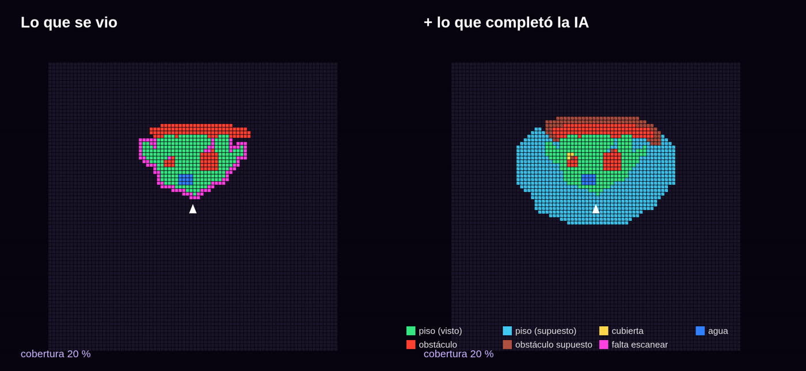
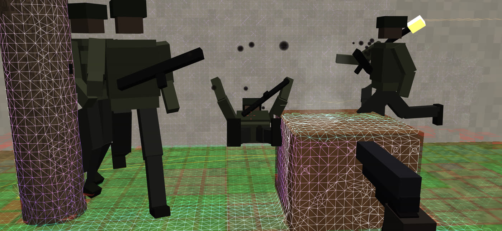

# Asalto MR — el shooter de realidad mixta del TikTok, en ARCore

Recreación del video de [@virtualgovr](https://vm.tiktok.com/ZN8rUTM9S/)
("Taking Down Enemies — Quest 3S"): soldados que corren por tu patio de
verdad, se paran a tirarte y, cuando les pegás, salen volando para atrás y caen
de espaldas sobre el piso real. Acá con un teléfono Android + ARCore, en
pantalla o en un visor tipo Cardboard (SBS).

```
./construir.sh          → salida/asalto-mr.apk  (~360 KB)
./pruebas/correr.sh     → pruebas del escaneo, del mapa de la IA y del juego (en la PC)
node pruebas/shaders.mjs → compila los 13 shaders con WebGL
./pruebas/vista.sh      → capturas de la vista previa (salida/vista-*.png)
```

| juego | escaneo | SBS (visor) |
|---|---|---|
|  |  |  |

| el mapa de la IA: lo visto y lo que completó | zonas y rutas en el piso |
|---|---|
|  |  |

Las capturas son de la **vista previa en la PC**: la malla es la que sale del
escaneo de verdad (Tsdf + Mallador sobre una escena de prueba filmada con una
cámara de profundidad simulada, con ruido), los soldados y la pistola son las
cajas que dibuja `Figuras.java` de verdad, y todo pasa por los mismos shaders
de la app. El "patio" de fondo es la escena de prueba dibujada por trazado de
rayos (en el teléfono es la cámara).

## El escaneo: polígonos, no "mesas y sillas"

No usa la detección de planos de ARCore para el juego (sólo como respaldo del
piso). Usa la **Depth API** (profundidad cruda + su confianza) y arma una malla
de todo lo que hay, como la malla de escena del Quest:

1. **Volumen de voxeles (TSDF)** — `Tsdf.java`. Cada imagen de profundidad son
   ~19.000 rayos: lo que queda antes del punto medido está libre, lo que queda
   justo detrás está ocupado. Se promedian muchas imágenes. Voxel de 5, 7 o
   10 cm (configurable), bloques de 16³, hasta 5.5 m (más lejos el ruido de
   ARCore crece con la distancia²). Borra "fantasmas" de cosas que se movieron.
2. **Malla (surface nets)** — `Mallador.java`. Un vértice por celda donde la
   superficie cruza, un cuadrilátero por arista: polígonos parejos, cerrados,
   bloque por bloque y sin costuras.
3. En un **hilo aparte** (`Escaneo.java`): la cámara nunca espera al escaneo.

La malla hace cuatro cosas:
- **oclusión**: lo real tapa a lo virtual (un soldado detrás de un árbol o de
  una mesa no se ve — mirá la captura);
- es el **piso** por donde caminan los soldados, lo que **esquivan** (troncos,
  paredes, muebles) y donde **pegan las balas** (chispas y polvo en la
  superficie real);
- el **efecto de escaneo**: las líneas de los polígonos, verde-agua lo
  horizontal y violeta lo vertical, con una onda que sale de vos cada 3 s;
- en SBS, el **entorno reproyectado**: la malla pintada con la imagen de la
  cámara, vista desde cada ojo, para que lo real también tenga profundidad.

### Lo medido (en la PC, escena sintética con ruido tipo ARCore)

| | |
|---|---|
| error medio de la malla | **1.2 cm** |
| vértices a más de un voxel (7 cm), a menos de 4 m | **0.2 %** |
| suelo bajo un punto / sobre la mesa | 0.1 cm / 0.0 cm de error |
| rayo a la mesa / al tronco | 1 mm / 6 mm de error |
| integrar una imagen 160×120 (PC) | ~20 ms (en el teléfono, 1 de cada 2 píxeles) |

`PruebaJuego`: los soldados caminan sobre el piso escaneado (0 de 1528 pasos
fuera), ninguno se mete en la mesa, el tronco o la pared, de un tiro caen para
atrás y quedan de espaldas sobre el piso real, el tiro a la mesa pega en la cara
correcta, la cabeza cuenta como cabeza, el cargador se recarga, las oleadas
avanzan.

## Escaneo completo, lo que no se ve, y la IA de zonas

### Escaneo completo (guiado)

Al empezar (o con Ajustes → "Escaneo completo") la app te guía hasta
escanear el lugar entero. Mira las **fronteras** (donde lo escaneado se corta
contra lo no visto) y te dice, en el HUD y en el minimapa:

- el **porcentaje de cobertura** (lo visto a menos de 6 m contra lo no visto
  que se llega desde una frontera, incluido lo que tenés atrás y a tus pies);
- **hacia dónde mirar**: "girá a la derecha →", "date vuelta", "mirá el piso
  cerca tuyo ↓", con una flecha magenta en el borde del minimapa;
- con **75 % o más** dice "Escaneo completo ✓" (en el visor arranca solo).

Los rayos de la profundidad ahora también guardan el **aire medido** (lo que
atravesaron). Con eso el mapa sabe dónde seguro no hay nada.

### Completar lo que no se ve

Ajustes → "Completar lo que no se ve". Sobre el mapa de zonas, cada celda no
vista toma lo que dicen sus vecinas, por pasadas:

- el **piso** se extiende hasta 2 m: debajo y detrás de las cosas, los huecos
  del escaneo;
- los **obstáculos** se completan por detrás hasta 50 cm (el fondo de la mesa
  y del tronco que nunca viste) y **todo obstáculo llega hasta el suelo**;
- lo que no tiene tapa vista (pared, árbol) sigue para arriba, no se le
  inventa un techo.

Hay tres reglas para no inventar cualquier cosa:
1. nunca contra aire medido: si un rayo pasó por ahí, ahí no hay nada;
2. en la sombra de algo alto y ancho (una pared) el piso entra solo 75 cm:
   detrás de un tronco se completa, detrás de una pared no se inventa un patio;
3. solo hasta 7 m: más lejos la profundidad es puro ruido.

Lo supuesto se escribe en el volumen como **inferido**. Sale en la malla en
**ámbar punteado** (lo real sigue verde y violeta), el juego lo usa (se camina
y se choca contra lo supuesto), y **cualquier medición de verdad lo
reemplaza**: si después lo ves, se corrige solo.

### La IA de zonas: por dónde pueden ir

- **Qué es cada cosa** (red neuronal): la *Scene Semantics* de ARCore es una
  red que etiqueta cada píxel de la cámara (cielo, edificio, árbol, calle,
  vereda, pasto, estructura, objeto, vehículo, persona, agua). La app vota esas
  etiquetas en cada voxel, entre muchas imágenes. Anda sobre todo **al aire
  libre** y no en todos los teléfonos; sin ella, la IA usa solo la forma.
- **El mapa** (algoritmo, en `Mapa.java`): celdas de 25 cm en 20 × 20 m.
  Cada celda es piso, obstáculo, **agua** (no se camina) o desconocida, con la
  altura del piso y del obstáculo. Además:
  - qué es **alcanzable** desde vos, con escalones de hasta 35 cm;
  - dónde hay **cubierta**: algo de ≥ 90 cm entre esa celda y vos que tapa la
    línea de tiro, comprobado con un rayo contra la malla;
  - **rutas A\*** que rodean obstáculos y agua, prefieren lo visto a lo
    supuesto y no se pegan a las paredes.
- **Los soldados** la usan:
  - aparecen solo en piso alcanzable (primero en lo visto);
  - van por ruta a una cubierta libre (cada uno la suya), se **agachan**
    detrás, esperan y se **asoman** a un costado desde donde te ven, o se paran
    y tiran por encima de una mesa;
  - después vuelven a cubrirse o te flanquean.

  Agachados reciben menos: la cabeza baja 55 cm.
- **Verlo**: Ajustes → "Ver las zonas de la IA": al escanear o siempre. Se ve
  sobre el piso real: verde caminable, celeste caminable supuesto, amarillo
  cubierta, azul agua, rojo obstáculo, magenta falta escanear. En "siempre"
  también se ven las rutas de los soldados. Y en el minimapa del HUD.

Para ser claro: la parte **red neuronal** es la de ARCore (qué es cada
superficie). El completado, el mapa, las rutas y la táctica son algoritmos
escritos acá (votos, pasadas, A\*, rayos), no un modelo entrenado.

### Lo medido (en la PC, la misma escena de prueba, escaneada sólo de adelante)

| | |
|---|---|
| celdas vistas bien clasificadas | **266 de 268** |
| piso con etiqueta "pasto" (con 10 % de error en la "red" simulada) | 213 de 213 |
| el tronco / la mesa / el charco | árbol / objeto / agua |
| piso cubierto del lugar | **52 % → 99 %** con el completado (201 → 383 de 388 celdas) |
| celdas supuestas correctas | **182 de 185 (98 %)** |
| malla supuesta cerca de lo real | error medio 9.7 cm, 87 % a menos de 10 cm |
| cubiertas que de verdad tapan | **3 de 3** |
| rutas | rodean el árbol, la mesa y el charco |
| guía de escaneo | siguiéndola se ve 47 % del piso real; al revés, 29 % |
| cobertura que dice / la de verdad | 20 % / 17 %, y 17 % / 13 % con menos escaneo |
| IA táctica, 40 s en difícil | 3 soldados se cubren; agachados, de verdad no los ves (100 % del tiempo); nunca pisan el charco ni se meten en un obstáculo |
| armar el mapa (PC) | ~65 ms, cada 1.5 s en el hilo del escaneo |

## Cómo se juega

- **Escaneá** primero: mirá el piso y alrededor moviéndote despacio. Cuando
  hay piso y malla suficiente dice "Listo": tocá para empezar (en el visor
  arranca solo a los 3 s).
- **Disparar**: tocar la pantalla (o el botón del visor, que toca la
  pantalla), **volumen +/−**, un control Bluetooth (A, R1, R2) o un disparador
  de selfie. Se apunta con la mira del centro (con la cabeza, en el visor).
  **Recargar**: X o B del control (o sola, al vaciar el cargador).
- Si aguantás 4 s sin que te den, te vas curando. La dificultad cambia cuánto
  apuntan, cuánto pegan y lo rápido que corren.

## SBS (visor) y su configuración

Botón **SBS** (o Ajustes → Modo). Se sale con **Atrás**. En Ajustes:

| ajuste | qué hace |
|---|---|
| Entorno en SBS | **Plano**: la imagen de la cámara igual en los dos ojos (lo virtual sí tiene profundidad). **3D**: el entorno reproyectado con la malla en cada ojo |
| Distancia entre ojos (IPD) | separación de las cámaras virtuales (63 mm por defecto) |
| Centro de los lentes | dónde caen los centros de los lentes en la pantalla (en mm reales, con los dpi del teléfono) |
| Tamaño de la imagen | cuánto de cada mitad ocupa (achicar = ver más de golpe) |
| Corregir lentes, k1, k2 | deforma en barril para compensar los lentes (k1 0.22, k2 0.12 para un Cardboard típico) |
| Ojos cambiados | para mirar cruzado sin visor |

El HUD (puntos, vida, balas, mira, borde rojo al recibir) se dibuja en
OpenGL para que salga en los dos ojos.

## La cámara ultra angular: lo que se puede y lo que no

- **Lo que se puede** ("Más ancha", por defecto): ARCore ofrece varias
  configuraciones de la cámara trasera. La 16:9 recorta el sensor; la 4:3 lo
  usa entero. La app mide el campo visual de cada una (focal y tamaño del
  sensor de Camera2) y elige la de más campo; si el teléfono tiene sensor ToF,
  lo prefiere. El campo que quedó sale en Ajustes.
- **Lo que es un intento** ("Ultra angular", experimental): ARCore sólo corre
  sobre la cámara que tiene calibrada (la principal) y no deja elegir la ultra
  angular. La app abre la cámara en **modo compartido** y le pide a Camera2
  **zoom < 1×** (`CONTROL_ZOOM_RATIO`), que en los teléfonos que lo permiten
  cambia al lente ultra angular del mismo módulo. En Ajustes dice qué pasó
  ("pedido zoom 0.6×" o "tu teléfono no baja de 1×"). Si el teléfono lo acepta,
  la imagen se ve más ancha **pero ARCore sigue creyendo que es la principal**:
  el seguimiento, la profundidad y la alineación de lo virtual pueden quedar
  mal. Si falla, vuelve solo a "Más ancha". Es un límite de ARCore, no algo
  que se arregle desde la app.

## Lo que NO se probó

- **En un teléfono.** Esta máquina no tiene uno. Está probado: el escaneo y
  el juego y la IA del mapa (pruebas en la PC), que los 13 shaders compilan y enlazan, el dibujo
  de soldados/pistola/malla/SBS/lentes (vista previa con el código real), y
  que el APK compila, firma y trae ARCore. **No** está probado: el camino con
  ARCore de verdad (la profundidad cruda, las poses, el modo compartido de la
  cámara), el rendimiento en el teléfono, ni el visor.
- La Depth API la tienen muchos teléfonos con ARCore, pero no todos. Sin ella
  no hay malla: se juega sobre los planos del piso y no hay oclusión.
- La imagen de la red semántica se lleva a la de profundidad escalando las
  coordenadas (se asume que cubren el mismo campo, como la profundidad).
  Si las etiquetas salen corridas en los bordes de las cosas, es eso.
- El completado es una suposición razonable, no magia: acierta en la escena de
  prueba, pero una casa de verdad tiene cosas que no se pueden adivinar
  (debajo de una mesa hay aire, no una caja). Por eso se ve distinto y se
  corrige al mirarlo.
- La correspondencia profundidad ↔ intrínsecos usa los de la textura escalados
  a la imagen de profundidad (como el ejemplo de profundidad cruda de ARCore).
  Si la malla sale corrida respecto de lo real, es lo primero a revisar.

## Seguridad

En el video el tipo juega **arriba de una moto** (y el propio video avisa
"no andes en moto en MR"). No lo hagas: con la cámara tapándote la vista
real, jugá parado o caminando despacio, en un lugar despejado.

## Archivos

| archivo | qué hace |
|---|---|
| `src/.../Tsdf.java` | el volumen de voxeles: integrar la profundidad, aire medido, etiquetas semánticas, lo inferido, suelo, rayos |
| `src/.../Mallador.java` | surface nets: de voxeles a polígonos |
| `src/.../Escaneo.java` | el hilo del escaneo (y el mapa cada 1.5 s) |
| `src/.../Mapa.java` | la IA del entorno: zonas, completado, cubiertas, rutas A\*, cobertura |
| `src/.../ZonasGl.java` | las zonas pintadas sobre el piso |
| `src/.../Juego.java` | soldados, disparos, caídas, partículas, oleadas (sin Android) |
| `src/.../Principal.java` | la actividad: ARCore, profundidad, entrada, dibujo por ojo |
| `src/.../Camara.java` | elegir la cámara más ancha; el intento de ultra angular |
| `src/.../MallaGl.java` | la malla en la GPU: oclusión, líneas, sólida, reproyectada |
| `src/.../Figuras.java` | soldados, pistola, partículas, trazadoras |
| `src/.../Hud.java` · `Lentes.java` | el HUD en GL; la corrección de lentes |
| `src/.../Ajustes.java` · `Panel.java` | la configuración y su panel |
| `src/.../Sonido.java` | los sonidos, sintetizados al arrancar |
| `pruebas/PruebaEscaneo.java` · `PruebaJuego.java` · `PruebaMapa.java` | las pruebas en la PC |
| `pruebas/shaders.mjs` · `vista.mjs` · `vista/` | shaders con WebGL; la vista previa |
| `construir.sh` | arma el APK sin Gradle (caché compartida con mundo-ar) |
