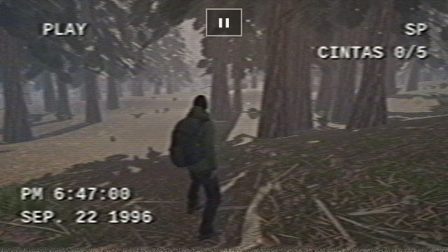
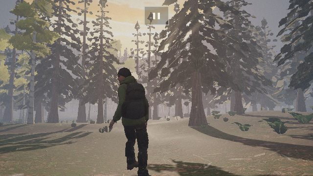
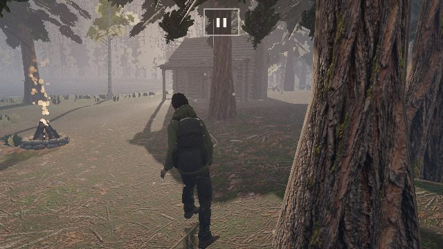
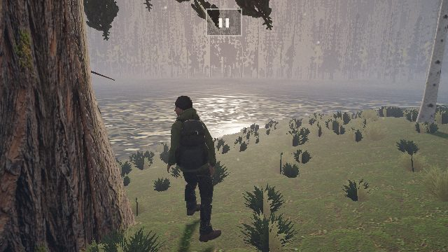

# BOSQUE — el atardecer que no termina

Un bosque en tercera persona, grabado en VHS. Cinco cintas perdidas entre el
sendero, la cabaña, la fogata, el mirador y los abedules. Cuando la imagen
empieza a fallar, hay una cinta cerca.

    npm install
    node herramientas/armar.mjs          # arma dist/ (juego.js + datos/)
    cd dist && python3 -m http.server    # y abrir http://127.0.0.1:8000
    node pruebas/ver.mjs                 # recorre el bosque y saca capturas
    node pruebas/cintas.mjs              # las cinco cintas de punta a punta

**Para jugar:** https://rezona.ai/game/pgcserver/play/VvyVJutbOf

| | |
|---|---|
|  |  |
|  |  |

**Controles.** Teléfono: pulgar izquierdo camina (a fondo, corre), pulgar
derecho mira. Compu: WASD o flechas, Shift corre, clic y mouse para mirar, E
recoge, V prende y apaga el VHS.

---

## Qué salió de Higgsfield y qué no

Todo lo que se ve es de Higgsfield, **203 créditos** en total (de 4.350). El
detalle, con cada pedido y su id, está en `herramientas/higgsfield.json`.

| qué | cómo |
|---|---|
| el cielo 360 | una imagen 21:9 a 4k, llevada a equirectangular |
| suelo, musgo, sendero, roca, dos cortezas | imágenes 1:1, hechas repetibles y con mapa de normales |
| ramas de abeto y de pícea, helecho, pasto, hojas de abedul, flores | imágenes sobre blanco + quitar fondo |
| rocas, laja, tronco caído, tocón, cabaña, fogata, la cinta | imagen → 3D (Tripo) |
| el caminante | imagen → 3D (Meshy) → esqueleto con 4 animaciones |

**Los árboles NO salieron enteros de un generador 3D, y fue a propósito.** Un
imagen-a-3D devuelve la copa como un bloque de arcilla pintado de verde: de
lejos pasa, a los dos metros de la cámara en tercera persona es un repollo. Acá
el esqueleto lo arma el código —el tronco que se afina, los pisos de ramas que
se caen con el largo, los palitos secos abajo— y las fotos ponen lo que el
código no sabe dibujar: la corteza y las agujas. Tres niveles de detalle, y el
más lejano es una foto del mismo árbol sacada al arrancar.

**El sonido es todo sintetizado.** Los modelos de música y efectos de
Higgsfield están habilitados solo para su propio constructor de juegos; la
herramienta lo dice. Así que el viento, los pájaros, el carpintero, los pasos
(distintos en el sendero, en la hojarasca y en el agua), el fuego, el agua de la
orilla y la estática de la cinta salen de osciladores y ruido filtrado.

**Rezona no generó nada.** La prueba de cobro volvió a dar
`CREDIT_RESERVE_FAILED` ("el servicio de cobro no está disponible"), igual que
en Enjambre, aunque la cuenta muestra 446.000 créditos. La subida de proyectos
sí anda: el enlace para jugar es de Rezona.

## Lo medido

En el navegador de las pruebas (Chromium con SwiftShader, o sea **dibujando por
procesador**, sin placa de video):

| | |
|---|---|
| árboles | **3.139** (abetos, píceas y abedules) |
| helechos / matas de pasto / flores | 2.242 / 7.589 / 141 |
| triángulos de un abeto cercano / medio / lejano | ~2.600 / ~500 / 4 |
| triángulos por cuadro, calidad alta | **310 mil a 760 mil** según dónde |
| llamadas de dibujo por cuadro | 60 a 74 |
| armar el mundo (rejilla, árboles, flora, objetos) | ~1,4 s |
| descarga total | **9,3 MB** (708 KB de código, el resto texturas y modelos) |

**Lo que NO está medido: los cuadros por segundo en un teléfono.** Este
navegador tarda ~1,5 s por cuadro porque no tiene placa; ese número no dice
nada de un teléfono y no se va a afirmar ninguno. Lo que sí está hecho para
eso: con VHS se dibuja a 480 líneas (la cuarta parte de los pixeles de un
teléfono), la resolución baja sola si el cuadro pasa de 40 ms, y la calidad se
elige mirando el aparato.

## Por qué el VHS lo hace más real

Un render limpio delata lo falso: los bordes perfectos de las hojas recortadas,
la textura que se repite, los colores demasiado puros. Una cinta borra justo
eso. No es un filtro de color: la imagen se separa en luminancia y color (YIQ,
lo de la señal de video) y cada uno se degrada con su propio ancho de banda —
~330 puntos por línea la luz y ~45 el color, que además llega tarde y sangra a
la derecha—, con el halo de "afilado" de la electrónica, el temblor de cada
línea, la franja de tracking que sube, el cabezal roto abajo y la fecha que la
cámara estampó y que se degrada con todo lo demás.

Y el filtro es el radar: cerca de una cinta sin recoger la imagen falla más.

## Trampas que costaron algo (para no volver a pagarlas)

- **La cabaña no aparecía por ningún lado.** Los GLB vienen cuantizados:
  posiciones en enteros de 16 bits entre -1 y 1, con la escala en el nodo. Al
  hornear la escala en los vértices todo lo que pasa de 1 se recorta sin aviso,
  y la cabaña de 9,5 m quedó aplastada en un cubo de 2 m. Se pasa a coma
  flotante antes (`aFlotante` en `props.js`).
- **Las rocas eran la mitad del cuadro.** Las 209 rocas, troncos y tocones se
  dibujaban todas, siempre, y dos veces por la sombra: 564 mil triángulos por
  pasada (85 × 2.532 + 26 × 2.622 + 46 × 2.834 + 52 × 2.909), cuando el cuadro
  entero medía 1,4 a 1,6 millones con `renderer.info` sumando las cuatro
  pasadas. Ahora entra lo que está a menos de 60-110 m y en pantalla.
- **La partida arrancaba con la pantalla azul.** La marca de tiempo del primer
  `requestAnimationFrame` puede ser anterior al `performance.now()` que se tomó
  al armar: el primer `dt` daba negativo y prendía solo el "azul de casetera".
- **Cuadros negros de a ratos.** Cambiarle el tamaño al lienzo lo borra; la
  resolución que se adapta lo hacía después de dibujar y el navegador mostraba
  el lienzo vacío. Ahora se cambia al empezar el cuadro. Y todos los shaders se
  compilan durante la carga: si no, el primero que aparecía se trababa.
- **El ambiente le ganaba al sol.** Con el cielo y el reflejo del panorama
  sumando más que el sol sobre el suelo, el bosque salía plano y lechoso. Lo
  que da forma al atardecer es el contraste: sol dorado rasante y sombra azul.
- **El pasto salía blanco.** La foto es casi paja con espigas blancas; a plena
  luz eran abanicos de papel. Se tiñe hacia el verde.
- **La cámara adentro de los árboles.** Las píceas barren el piso con las
  ramas; en tercera persona eso es la cámara metida en una copa cada diez
  pasos. La copa arranca arriba de los 5 m, ninguna rama baja de 3,2 m y el
  follaje que roza la cámara se abre con un tramado.
- **El menú no entraba en un teléfono acostado.** 360 px de alto: el botón de
  PLAY quedaba debajo del borde y no había forma de empezar.
- **Dos parches de shader se pisaban.** `onBeforeCompile` es uno por material,
  y three reutiliza programas entre materiales cuyos parches tienen el mismo
  texto. `parche.js` encadena y le da a cada parche su clave.
