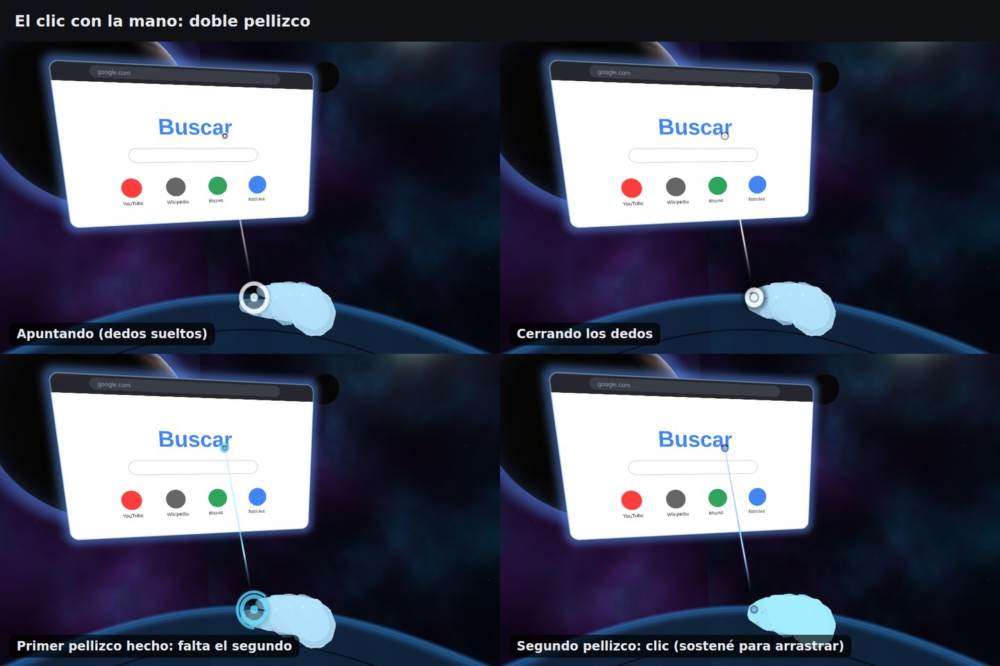
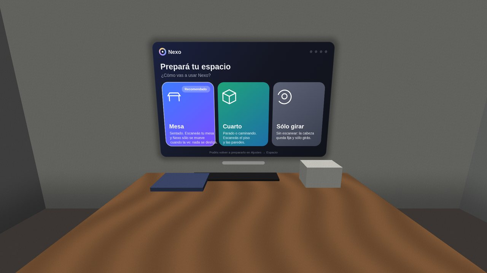
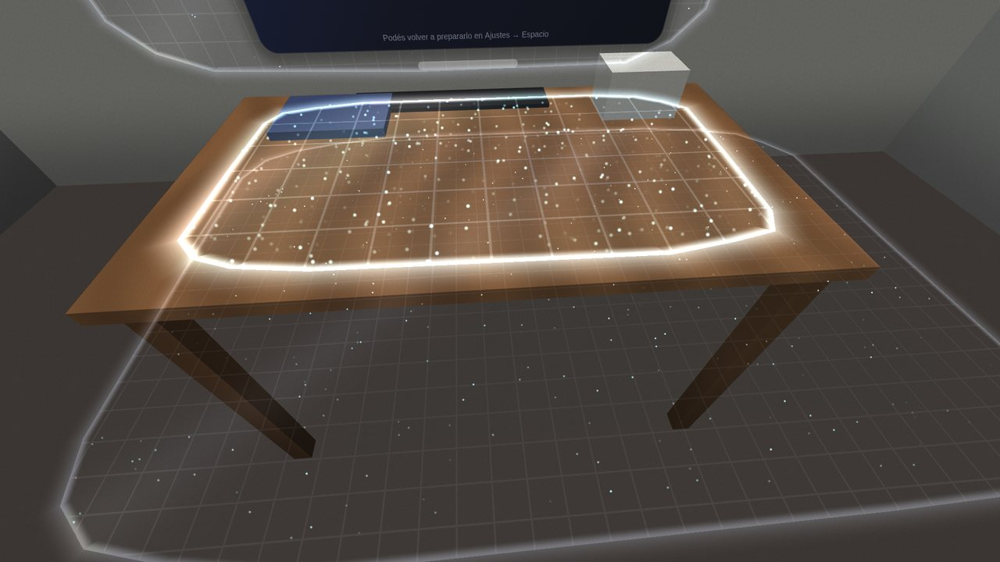
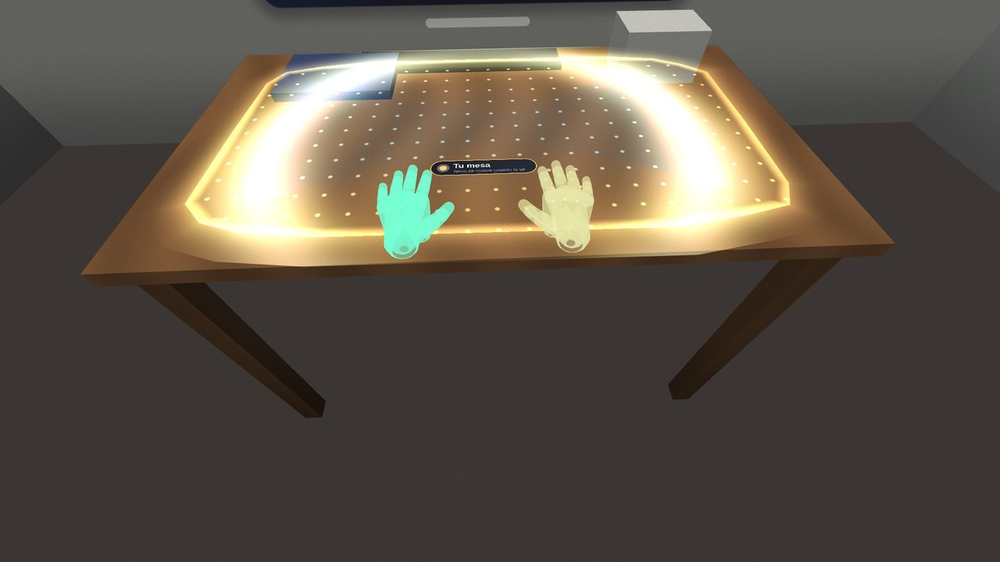
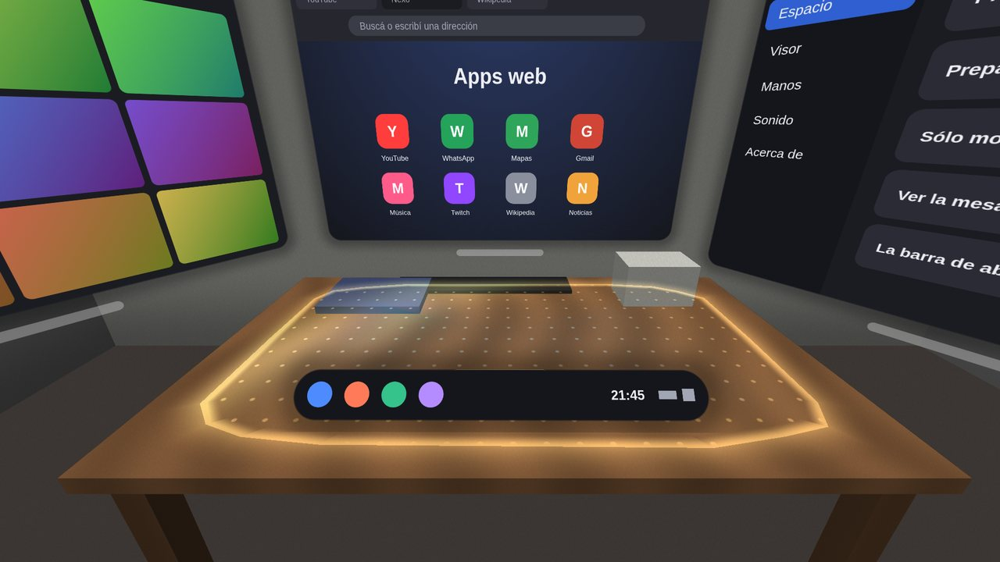

# Nexo XR

Un sistema de realidad mixta para el **teléfono Android**, a mano o adentro de
un visor tipo **VR Box**: pantallas de verdad flotando en el espacio, entornos
3D, passthrough con la cámara, tus manos para hacer clic, una barra de abajo
con las apps, ajustes rápidos y un teclado en el espacio. Está inspirado en
cómo se usan los visores de realidad mixta (el flujo, los gestos, el aspecto),
con nombre, íconos y diseño propios.


| | |
|---|---|
|  |  |
|  | *Vista previa en la PC con los shaders de la app y las ventanas donde las pone el escritorio. Lo que muestra cada ventana es una maqueta: en el teléfono son las pantallas de Android de verdad.* |

## Qué hay

- **Pantallas de verdad en el espacio.** Cada ventana es una vista de Android
  real (un `WebView`, una grilla de fotos, los ajustes) en su propia pantalla
  virtual, que se copia a una textura y se dibuja donde está la ventana, con
  las esquinas redondeadas, una sombra suave y un borde que se enciende cuando
  la apuntás. Los toques del puntero se vuelven toques de Android: un clic es
  un clic, pellizcar y mover es scroll.
- **Clic con doble pellizco.** Un pellizco solo no hace nada (la mano que se
  cierra sin querer no aprieta botones): el primero arma, el segundo aprieta.
  El indicador de la mano muestra todo (ver [El indicador](#el-indicador-de-la-mano)).
- **Tu espacio (Nexo Inicio).** Antes de empezar escaneás tu mesa, apoyás las
  manos y fijás la cabeza; después Nexo **sólo se mueve cuando ve tu mesa**
  (ver [Tu espacio](#tu-espacio-nexo-inicio)).
- **Las apps de Nexo** (cada una en su ventana, en el espacio)
  - **Navegador**: la web entera, con **pestañas**, atrás / adelante /
    recargar, la dirección, el **modo escritorio** (la versión de
    computadora), **★ Agregar a Apps** (la página queda como una app), las
    descargas a Descargas, y el video a pantalla completa adentro de la ventana.
  - **Apps web**: YouTube, WhatsApp (en modo escritorio), Mapas, Gmail, YT
    Música, Twitch, Wikipedia, Noticias, Drive, Traductor, Instagram, X, y las
    que agregues vos: **cada una en su propia ventana**, con tu sesión
    guardada. Sin logos: una baldosa de color con la inicial.
  - **Galería** y **Cine**: tus fotos y videos (el Cine: sólo los videos, en
    grande, con su duración); con anterior y siguiente, play, pausa y la barra.
  - **Música**: tus canciones del teléfono, con la tapa, la barra, anterior,
    siguiente y mezclar. **Sigue sonando con la ventana cerrada.**
  - **Notas**: la lista y el editor; se guardan solas mientras escribís con el
    teclado de Nexo.
  - **Calculadora**: teclas grandes, el resultado mientras escribís, √, ^, π,
    paréntesis, el porcentaje "de celular" (200 + 10 % = 220) y el historial.
  - **Reloj**: la esfera que se mueve suave, la hora de otras ciudades, un
    **temporizador** (suena aunque cierres la ventana) y un **cronómetro** con
    vueltas.
  - **Clima**: buscás tu ciudad y ves ahora, las próximas 18 horas y 7 días,
    con el cielo de fondo (datos de Open-Meteo, libre y sin cuenta).
  - **Archivos**: una carpeta del teléfono (la elegís una vez) con sus
    carpetas; abre fotos, videos, música, textos y **PDF** página por página.
  - **Ajustes**: entorno, **espacio**, visor (SBS, distancia entre ojos,
    lentes, campo visual, Nexo Track), manos y control, sonido, acerca de.
  - **Apps**: todo lo de arriba en baldosas, y las del teléfono (esas se
    abren en la pantalla del teléfono, fuera del visor).
  - **Cómo se usa**: la bienvenida con los gestos (sale la primera vez).
- **El escritorio.** Hasta 3 apps en un arco delante tuyo (centro, izquierda,
  derecha, a 1.1 m); la cuarta reemplaza a la más vieja. Debajo de cada
  ventana, la **barra** para moverla (sigue al rayo y siempre te mira de
  frente), **✕** para cerrarla y **⤢** para el **modo cine** (3.4 m de ancho a
  3.2 m, con el entorno a media luz).
- **La barra de abajo**: Apps, Navegador, Galería, Ajustes (con un punto
  debajo de las abiertas), la hora, el wifi, la batería y los **ajustes
  rápidos**: passthrough, entorno, recentrar, captura, **linterna**, visor,
  manos, teclado, ajustes, **tu espacio** y el volumen.
- **Linterna**: prende el flash de atrás. Con ARCore se prende por su
  configuración (la cámara la tiene ARCore: no se corta el seguimiento, y en la
  oscuridad ayuda a que se vean las manos); sin ARCore, directo con la cámara
  del teléfono. Si el teléfono no la deja mientras ARCore usa la cámara, avisa.
- **El teclado del sistema**, en el espacio, debajo de la ventana enfocada
  (con ñ, números y símbolos, ".com"); sale solo cuando tocás un campo de
  texto. El de Android no se abre.
- **Entornos 3D**: **Espacio** (estrellas, nebulosa, un planeta con su
  atmósfera, una luna, una plataforma de vidrio), **Lago al atardecer** (sol
  bajo, nubes, montañas, un muelle, el agua que refleja el cielo), **Living**
  (piso de madera, alfombra, una ventana enorme al bosque, chimenea, sillón,
  biblioteca). Cada uno es un shader con cuentas cerradas: nítido en los dos
  ojos y rápido. Y **Passthrough**: la cámara.
- **Captura**: lo que ves, a la galería (Pictures/Nexo).
- **Sonidos** del sistema sintetizados (clic, abrir, cerrar, captura, arranque).

- **Se actualiza sola.** Al abrir (y cada 6 h) Nexo se fija si hay una
  versión nueva; si hay, se abre la ventana **"Nexo 1.x está lista"** con lo
  que trae y el botón **Actualizar**: la baja, revisa que sea la publicada
  (tamaño, SHA-256, que sea Nexo, más nueva y con la misma firma) y la
  instala. También en Ajustes → Acerca de. Ver [Actualizaciones](#actualizaciones).

## Cómo se usa

| | con las manos | sin manos |
|---|---|---|
| **clic** | **doble pellizco** (pulgar con índice, dos veces rápido) apuntando | mirá fijo 1 s (en el visor) · tocá la pantalla del teléfono · el gatillo del control |
| **scroll / arrastrar** | doble pellizco, sostené el segundo y mové | el joystick del control (arriba / abajo) |
| **tocar** | con la punta del índice, en las pantallas cercanas | — |
| **mover una ventana** | doble pellizco en su barra, sostené y llevala | lo mismo con la mirada + gatillo |
| **la barra de abajo** | un doble pellizco en la nada la muestra / esconde | el botón de menú del control · Atrás |
| **recentrar** | doble pellizco sostenido 1 s en la nada | el botón "B" del control · ajustes rápidos |

**El doble pellizco** (`DoblePellizco.java`): el primero tiene que ser corto
(soltarlo antes de 0.45 s: si lo sostenés es agarrar algo, no un clic) y el
segundo tiene que llegar antes de 0.55 s de soltar el primero. El segundo es
el que aprieta: soltarlo es el clic, sostenerlo es arrastrar. Un tercero
seguido no es otro clic. En Ajustes → Manos → *Clic con doble pellizco* se
puede volver a un pellizco solo.

Tres cosas para que el clic caiga donde apuntás (como en los visores):
1. al pellizcar la mano se mueve: el clic usa **el rayo de 80 ms antes**; con
   el doble pellizco (la mano se mueve dos veces), **el de antes del primer
   pellizco**, si desde ahí no moviste el rayo más de 4°;
2. hasta que el rayo se mueve más de 1.2° (o el dedo 1.2 cm) se informa **el
   mismo punto** donde se bajó: un clic no se vuelve un arrastre;
3. lo que se agarró **queda agarrado** hasta soltar, aunque el rayo se salga.

El rayo de la mano sale del **punto de mira** (un poco debajo de la vista) por
los **nudillos** (que no se mueven al pellizcar), como aprendimos con Asalto
MR: la distancia de la mano, lo que peor mide una cámara, no lo mueve.

### El indicador de la mano



Tres piezas que dicen lo mismo:
- **el anillo entre el pulgar y el índice**: va de la punta de un dedo a la
  del otro, se achica al juntarlos y se llena cuando el pellizco cuenta (ves
  cuánto te falta antes de que pase);
- **el rayo sale de ahí**: grueso en la mano y fino en la punta, con un halo;
  se prende a medida que cerrás los dedos;
- **el cursor** donde pega: un punto con un anillo que se cierra sobre él al
  pellizcar, con un borde oscuro para verse sobre páginas blancas.

Después del primer pellizco los tres se ponen **celestes**: el cursor y el
anillo de la mano muestran un arco que se acaba (lo que queda para el
segundo) y por el rayo corre un pulso hacia el cursor. Apretando: azul lleno.

## Tu espacio (Nexo Inicio)

| | |
|---|---|
|  |  |
|  |  |

*Vista previa en la PC: la pieza y la mesa las dibuja la prueba (como si fueran
la cámara); lo demás son los shaders de la app y las cuentas de verdad (el
polígono de la mesa y su malla, las guías, dónde va cada ventana).*

Al abrir Nexo (con ARCore) sale **"Prepará tu espacio"**:

1. **Elegir**: **Mesa** (sentado, recomendado), **Cuarto** (parado o
   caminando) o **Sólo girar** (sin escanear: la cabeza fija, nada se desliza
   nunca).
2. **Escanear tu mesa**: mirás la mesa y movés un poco la cabeza. ARCore
   encuentra las superficies (se ven como una grilla, y los puntos que sigue,
   titilando); Nexo elige la que es **tu mesa**: horizontal, entre 15 cm y
   1.05 m debajo de los ojos (el piso queda afuera), de al menos 30 × 25 cm,
   cerca y adelante. Cuando es grande y no cambia 1.2 s se confirma sola (o
   "Esta es mi mesa"): queda **marcada** (puntitos cada 5 cm, un borde dorado
   que late, una luz que la recorre, una onda que sale de donde mirabas y la
   etiqueta **"Tu mesa"**), y el ancla del escritorio pasa a ser la mesa.
3. **Apoyar las manos** sobre las dos manos de guía (doradas; se ponen verdes
   cuando la tuya está encima). Con la mesa se sabe **a qué distancia están de
   verdad** tus manos (lo que una sola cámara mide peor): cada punto de la
   palma está sobre su rayo, y donde ese rayo corta la mesa es su lugar. De
   ahí sale el tamaño de tus manos (se guarda). Sólo se mide con la palma
   **plana y apoyada** (la normal de la palma contra la de la mesa: inclinada
   25° o más, no cuenta).
4. **Fijar la cabeza**: mirás al frente, quieto 1.2 s (un anillo se llena):
   ahí quedan tus pantallas.
5. **¡Listo!** y la **barra de abajo apoyada en la mesa**, delante tuyo: la
   tocás con el dedo y la mesa te frena.

**Sólo se mueve cuando ve tu mesa.** En vez de "adivinar" dónde estás todo el
tiempo, la posición sólo sigue a ARCore cuando la cámara **está viendo la
mesa**: los puntos que ARCore sigue en esa foto caen sobre ella (a menos de
3 cm del plano y adentro del polígono), o está bien a la vista. Si no la ve
(mirás el techo, una pared lisa, las ventanas de arriba), **el cuello queda
quieto y la cabeza sólo gira**: nada se desliza. Cuando la vuelve a ver, se
acomoda suave. Sin parpadear: se prende con 2 fotos seguidas y se apaga a los
450 ms sin verla. Si ARCore pierde el plano de la mesa, Nexo la vuelve a
encontrar solo (a la misma altura, cerca de donde estaba).

En **Cuarto**, lo mismo con todo lo que escaneaste (el piso, las paredes, las
mesas): se mueve cuando lo reconoce.

Ajustes → **Espacio**: preparar el espacio ahora, al empezar sí o no, sólo
moverse cuando ve la mesa, ver la mesa marcada, la barra sobre la mesa, y el
tamaño de tus manos medido. También está en los ajustes rápidos (**Tu
espacio**) y en Apps.

## El visor (VR Box)

Ajustes → Visor: **Modo visor** (dos imágenes), distancia entre ojos,
**campo visual** del visor (60–120°), la corrección de los lentes (k1, k2) y
el tamaño. En el visor, el passthrough se pone **en el mundo**, a 8 m, del
tamaño exacto de lo que ve la cámara: cada ojo lo ve con su propia proyección
y en su escala justa (se ve como una ventana a la realidad, no estirado).

## El seguimiento: Nexo Track

- **Con ARCore**: 6 grados de libertad (caminás y todo queda en su lugar), el
  passthrough, las manos (MediaPipe, con el filtro de Asalto MR) y el piso (el
  plano más bajo que encuentra ARCore). La cámara: la de más fps que ofrezca
  ARCore (60 si hay) y la imagen cerca de 640×480.
- **Sin ARCore** (o sin permiso de la cámara): los sensores del teléfono, sólo
  girar la cabeza; los entornos 3D, la mirada, la pantalla y el control.

ARCore es cerrado: no se puede arreglar por dentro. **Nexo Track**
(`Seguimiento.java`, `Cuello.java`) es la capa entre su pose y lo que se ve, y
arregla lo que hacía que el mundo "se moviera solo":

| el problema | qué pasaba | qué hace Nexo Track |
|---|---|---|
| **la demora** | la pose de ARCore es la de la foto (30–80 ms antes) y se ve un cuadro después: girando la cabeza, el mundo se arrastra con vos y vuelve | lleva la rotación hasta el momento en que se ve con el **giroscopio** (200/s) y predice un poco más (Ajustes → Visor → Predicción del giro); la posición gira alrededor del **cuello** |
| **las correcciones** | cuando ARCore corrige su mapa, lo que no está anclado salta o se desliza | el escritorio cuelga de un **ancla** de ARCore: la corrección entera se aplica en el mismo cuadro, y la cabeza queda donde estaba |
| **las pérdidas** | poca luz, la cámara tapada o moverse rápido: todo desaparecía | sigue girando con el giroscopio (posición quieta), avisa **por qué** se perdió, y al volver el salto se funde en medio segundo |
| **los saltos** | ARCore a veces da un cuadro corrido | un salto imposible (> 12 cm de un cuadro al otro) se funde en vez de verse |
| **los ojos** | en el visor se dibujaba desde la cámara, que está en una punta del teléfono (unos 6 cm al costado y 7 cm delante de los ojos): al girar, lo cercano se deslizaba | **mide sola** dónde están los ojos mirando cómo girás la cabeza (el punto quieto al girar es el cuello; los ojos están delante y arriba). También a mano en Ajustes → Visor |

Con una cabeza simulada (`PruebaSeguimiento`: girando hasta 157°/s, fotos a
30/s que llegan 60 ms tarde, giroscopio a 200/s, 25 ms hasta verse):

| | sin la capa | con Nexo Track |
|---|---|---|
| atraso al girar | hasta **17.4°** y 5.2 cm | hasta **0.56°** y 0.17 cm |
| se pierde 1.5 s caminando 20 cm | todo en negro | sigue girando (0.55°); al volver, el paso más grande 1.9 cm y en su lugar |
| ARCore corrige el mapa 5 cm y 2° | el escritorio queda corrido 4.7 cm | 1.4 mm, sin saltar |
| los ojos (6 cm al costado) | — | medidos con menos de 1 cm de error; caminando no se mide |

Si igual algo anda mal: **Ajustes → Acerca de → Grabar un diagnóstico** (20 s
de lo que pasa en cada cuadro, a Descargas/Nexo) y mandame el archivo:
`python3 herramientas/diagnostico.py archivo.jsonl` dice cuánto se pierde y
por qué, cuánto tiembla y se desliza quieto, los saltos, y cómo andan las
manos (cuánto se ven, cuánto tiemblan, cuántas veces se cortan).

Lo que no arregla ninguna capa: si la **tapa del visor le tapa la cámara**,
con **poca luz** o mirando una **pared lisa**, ARCore no tiene qué seguir
(Nexo te dice cuál es). Y las manos se ven con una sola cámara de ~70°: fuera
de ese campo, no hay mano.

## El control Bluetooth

Los botones del VR Box en cualquier modo (música, gamepad, teclas): el
**gatillo** es el clic (con la mirada), **B / ↓** recentrar, **← →** modo
cine, **start / menú / Atrás del control** la barra de abajo, el **joystick
arriba / abajo** hace scroll. Ajustes → Manos y control → Configurar: aprende
los tuyos.

## Actualizaciones

```
publicar.sh ──► actualizacion/version.json + nexo-xr-N.apk ──► push de la rama
                                                                  │
Nexo (al abrir, cada 6 h) ◄── raw.githubusercontent.com ◄────────┘
   └─ hay una más nueva → ventana "Actualizar" → baja → revisa → instala
```

- **Publicar** (desde acá): `./publicar.sh "qué trae"` sube el número de
  versión (`versionCode` +1, `1.N`), arma el APK y deja en `actualizacion/`
  el APK (con el número en el nombre: nunca llega uno viejo de una caché) y
  `version.json` (versión, tamaño, SHA-256, huella de la firma, notas).
  Después, commit y push. La app lo lee de la rama `claude/hola-80z86i` (el
  repo es público); si falla, de raw.githack.com. Un campo `"feed"` en el
  json muda la dirección para las próximas.
- **En el teléfono**: la primera vez Android pide el permiso **"Instalar apps
  desconocidas"** para Nexo (se abre solo; activalo y volvé: sigue sola), y
  confirmar la instalación (si estás en el visor, sacalo un momento). Desde
  Android 12, cuando Nexo ya se instaló a sí mismo una vez, las siguientes
  pueden no preguntar nada. Al terminar, Nexo se vuelve a abrir (si el
  teléfono lo deja; si no, tocá el ícono) y te dice qué trajo.
- **La llave**: Android sólo instala una actualización encima si viene
  firmada con **la misma llave**. `construir.sh` usa, en este orden, la
  variable del entorno `NEXO_LLAVE` (el keystore en base64; `NEXO_LLAVE_CLAVE`
  y `NEXO_LLAVE_ALIAS` si no son `mundoar` / `prueba`) o la de la caché
  (`~/.cache/mundo-ar/prueba.keystore`). La caché se pierde cuando se recicla
  el contenedor: por eso la llave va guardada en `NEXO_LLAVE`. **Nunca al
  repo.** `publicar.sh` se niega a publicar un APK con otra firma que la
  publicada (el teléfono no lo instalaría), y la app, si igual le llega uno
  así, lo avisa antes de bajarlo.
- La primera versión con esto (**1.1**) se instala a mano una vez; de ahí en
  adelante, "Actualizar".

## Cómo está hecho

```
Principal ── ARCore / sensores ── la cabeza, la cámara, el piso
   │
   ├── Entornos (shaders) · Fondo (passthrough en el mundo) · Lentes (SBS)
   ├── Escritorio ── Ventana ×N (dónde va cada una: arco, dock, rápidos, teclado, cine)
   ├── Puntero ── manos (Gestos: pellizco, dedo) · mirada · pantalla · control → toques
   └── PanelVirtual ×N ── VirtualDisplay + Presentation (la vista de Android)
                           → SurfaceTexture → copia con mipmaps → VentanasGl
```

| archivo | qué hace |
|---|---|
| `Principal.java` | el sistema: seguimiento, dibujo por ojo, manos, entrada, lo que piden las apps |
| `Escritorio.java` · `Ventana.java` | dónde va cada pantalla, arrastrar, cerrar, cine, recentrar (sin Android) |
| `Puntero.java` · `Gestos.java` · `DoblePellizco.java` | de manos / mirada / pantalla / control a toques; el pellizco y el doble pellizco (sin Android) |
| `PanelVirtual.java` | una vista de Android en una pantalla virtual → textura; los toques y las teclas |
| `VentanasGl.java` · `Entornos.java` · `Fondo.java` | el dibujo de las ventanas, los entornos, el passthrough |
| `Dock.java` · `Rapidos.java` · `Teclado.java` | la barra de abajo, los ajustes rápidos, el teclado |
| `Navegador.java` · `Galeria.java` · `AjustesApp.java` · `Biblioteca.java` · `Bienvenida.java` | las apps |
| `Estilo.java` · `Iconos.java` · `Sonido.java` | el aspecto, los íconos (trazos), los sonidos |
| `Mano.java` · `FiltroMano.java` · `ManoRastreo.java` · `ManosGl.java` · `AsociadorManos.java` · `Lentes.java` · `Control.java` | de Asalto MR (manos, lentes, control) |
| `Actualizador.java` · `Instalacion.java` · `ActualizarApp.java` | buscar, bajar, revisar e instalar la versión nueva; lo que contesta el instalador; la ventana |
| `publicar.sh` · `actualizacion/` | publicar una versión (el APK y el `version.json` que mira la app) |
| `Seguimiento.java` · `Cuello.java` | Nexo Track: giroscopio + predicción, ancla, pérdidas y saltos, los ojos (sin Android) |
| `CamaraArcore.java` · `Diagnostico.java` · `herramientas/diagnostico.py` | la cámara de más fps; grabar y analizar un diagnóstico |
| `Mesa.java` · `Inicio.java` | tu mesa: elegirla, si se ve, dónde van las cosas, las manos de guía; los pasos del inicio (sin Android) |
| `SuperficiesGl.java` · `Etiqueta.java` · `InicioApp.java` | el dibujo de los planos, la nube y la mesa marcada; la etiqueta; la ventana del inicio |
| `AppsWeb.java` · `Calculo.java` · `Tiempos.java` · `Clima.java` · `TiposIcono.java` | las apps web, las cuentas, el cronómetro y el temporizador, el clima, los tipos de ícono (sin Android) |
| `MusicaApp.java` · `Reproductor.java` · `NotasApp.java` · `CalculadoraApp.java` · `RelojApp.java` · `ClimaApp.java` · `ArchivosApp.java` | las mini-apps |
| `herramientas/sin-parametros.py` | saca un atributo que el javac 21 escribe y con el que el d8 se cae |

## Pruebas (en la PC)

```sh
./pruebas/correr.sh     # escritorio y puntero, gestos con manos reales, Nexo Track, la mesa, las apps
./pruebas/vista.sh      # la vista previa (salida/vista-*.png y vista-inicio-*.png)
node pruebas/shaders.mjs
./construir.sh          # → salida/nexo-xr.apk
```

- `PruebaEscritorio`: dónde se abren, que miren a la cabeza, reemplazar la
  cuarta, el rayo le pega donde tiene que pegar, **el clic con el rayo de
  antes del pellizco** (y con el doble pellizco, **el de antes del primero**
  si la mano se corrió 1.5°, pero no si la moviste 13°), subir en el mismo lugar, scroll, arrastre que se sale
  de la ventana, mover de la barra (de frente a vos), cerrar, irse del botón
  antes de soltar no cuenta, cine y volver, **tocar con el dedo**, mirar fijo
  (carga, clic, no repite), pellizco en la nada corto y largo, recentrar.
- `PruebaSeguimiento`: Nexo Track con una cabeza simulada (la tabla de arriba),
  y que con la hora de las fotos en otra base no gira cualquier cosa.
- `PruebaMesa`: elige la mesa de adelante (no el piso, ni una repisa, ni la
  de atrás, ni una pared), también parado; de 240 puntos cuenta **exactamente
  los 120 que están sobre la mesa** (no los del piso, la pared ni la taza);
  cuánto de la mesa entra en la vista; la histéresis (no parpadea con un
  hueco de 250 ms, se apaga a los 450); las guías (la derecha a la derecha,
  los dedos adelante, apoyadas a 1–2 cm); **la escala de la mano apoyada:
  1.153 medida contra 1.150 de verdad** (y con temblor, error máximo 1.8 %);
  la mano inclinada 25° o más, o de canto, no cuenta; y los pasos del inicio
  (se confirma sola cuando no cambia, "Esta es mi mesa", saltar, el cuarto,
  sólo girar).
- `PruebaSeguimiento`, además: **sin ver la mesa, el cuello no se mueve (0.0
  mm) aunque ARCore se deslice 20 cm** y la cabeza se incline 15 cm, la
  cabeza sigue girando bien (0.65°), y al volver a verla se acomoda sin
  saltar (paso máximo 1.4 cm) y queda donde tiene que estar (1.1 mm).
- `PruebaApps`: la calculadora (precedencia, potencias de derecha a
  izquierda, paréntesis que faltan, 2π, porcentaje de celular, errores,
  0,1 + 0,2 = 0,3, miles y decimales), el cronómetro (pausas, vueltas), el
  temporizador (pausa, suena una sola vez, sumar andando), el clima (códigos,
  íconos, la ciudad con tildes, el día de la semana de cada fecha contra el
  calendario) y las apps web (guardar y leer, sin repetir, WhatsApp en modo
  escritorio).
- `PruebaGestos`: **ninguna de 19 manos reales** (puños, palmas, apuntando,
  agarrando) es un pellizco; pellizcar con 12 manos reales, con temblor:
  aprieta una vez, sin rebotes, y suelta. **El doble pellizco**: uno solo no
  aprieta, dos rápidos sí (una vez, mientras dura el segundo), lentos no, el
  primero sostenido no arma, doble y sostener aprieta todo ese rato, tres
  seguidos son un solo clic, la cuenta del cursor; y con las 12 manos reales
  (a 30 imágenes por segundo, con temblor): **doble pellizco = un clic en las
  12, un pellizco solo = ningún clic en las 12**.
- Los 8 programas de la app compilan y enlazan (WebGL), los 3 entornos se
  dibujan en la vista previa, y los de las superficies y las manos se dibujan
  en la vista del inicio (sin errores de WebGL); el indicador de la mano en
  sus cuatro momentos, en `pruebas/vista-puntero.mjs`.

## Lo que NO se probó

- **En un teléfono.** Acá no hay uno ni emulador (no hay KVM). Está probada la
  lógica (escritorio, puntero, gestos), los shaders y la vista previa, que el
  APK compila y firma, y que la publicación de las actualizaciones se baja
  bien y coincide (tamaño, SHA-256, firma). **No** está probado: las pantallas virtuales con las
  vistas de Android (que se vean, los toques, el teclado), el WebView adentro,
  el video, ARCore, las manos en vivo, el rendimiento ni el visor. Si algo
  sale en negro, no responde o se cierra: la próxima vez que abrís, Nexo
  muestra el error arriba; pasame una captura.
- La instalación de la actualización en el teléfono (el permiso, la
  confirmación, volver a abrirse) no se pudo probar acá.
- Nexo Inicio con una mesa de verdad (que ARCore encuentre la tuya, que la
  nube de puntos alcance para "verla", las manos sobre las guías), y las
  mini-apps (la música, los archivos, el clima con internet) no se probaron
  en un teléfono: están probadas sus cuentas y que compilan.
- El teclado escribe en los campos de texto de las apps y de las páginas con
  teclas; alguna página rara puede no tomarlas.
- Sin ARCore, girar la cabeza usa los sensores y la orientación del teléfono
  acostado; si queda al revés, es lo primero a revisar.
