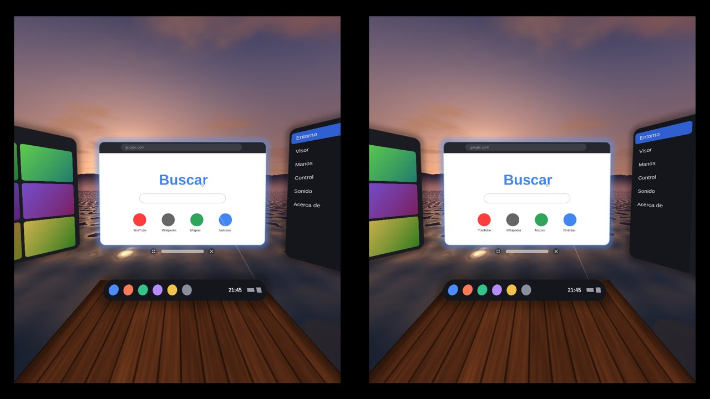
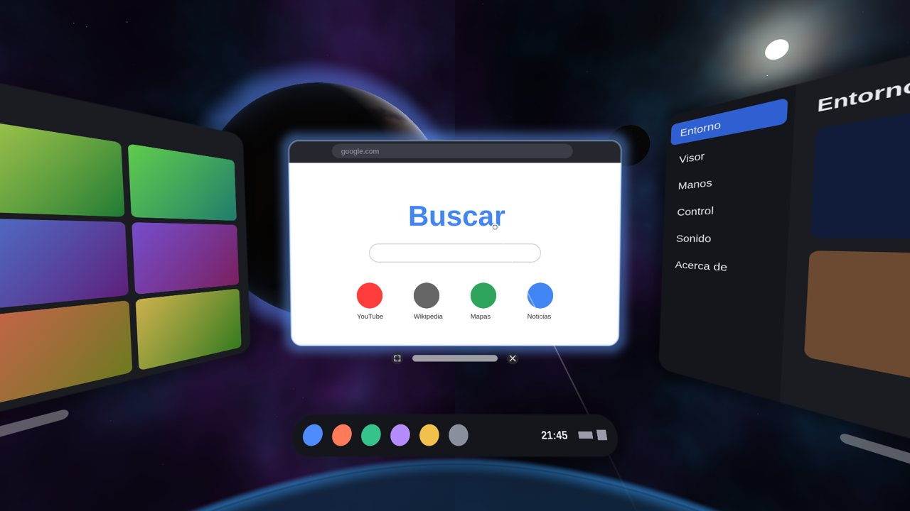
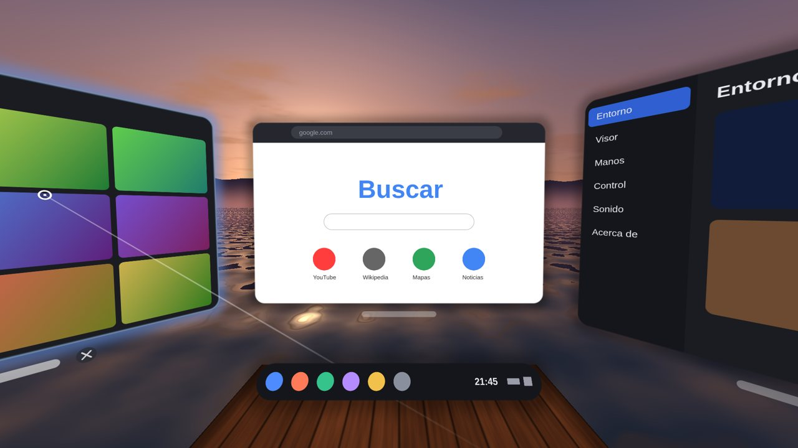
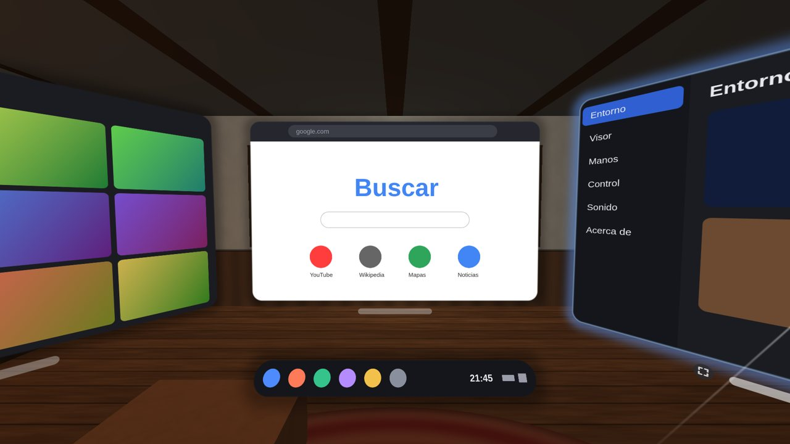

# Nexo XR

Un sistema de realidad mixta para el **teléfono Android**, a mano o adentro de
un visor tipo **VR Box**: pantallas de verdad flotando en el espacio, entornos
3D, passthrough con la cámara, tus manos para hacer clic, una barra de abajo
con las apps, ajustes rápidos y un teclado en el espacio. Está inspirado en
cómo se usan los visores de realidad mixta (el flujo, los gestos, el aspecto),
con nombre, íconos y diseño propios.



| | |
|---|---|
|  |  |
|  | *Vista previa en la PC con los shaders de la app y las ventanas donde las pone el escritorio. Lo que muestra cada ventana es una maqueta: en el teléfono son las pantallas de Android de verdad.* |

## Qué hay

- **Pantallas de verdad en el espacio.** Cada ventana es una vista de Android
  real (un `WebView`, una grilla de fotos, los ajustes) en su propia pantalla
  virtual, que se copia a una textura y se dibuja donde está la ventana, con
  las esquinas redondeadas, una sombra suave y un borde que se enciende cuando
  la apuntás. Los toques del puntero se vuelven toques de Android: un clic es
  un clic, pellizcar y mover es scroll.
- **Las apps**
  - **Navegador**: la web entera, con atrás / adelante / recargar, la
    dirección, un inicio con accesos directos, y el video a pantalla completa
    adentro de la ventana.
  - **Galería**: tus fotos y videos del teléfono; se ven grandes, con anterior
    y siguiente, y los videos con play, pausa y la barra para adelantar.
  - **Ajustes**: entorno, visor (SBS, distancia entre ojos, lentes, campo
    visual), manos y control, sonido, acerca de.
  - **Apps**: las del sistema en baldosas grandes, y las del teléfono (se
    abren en el teléfono).
  - **Cómo se usa**: la bienvenida con los gestos (sale la primera vez).
- **El escritorio.** Hasta 3 apps en un arco delante tuyo (centro, izquierda,
  derecha, a 1.1 m); la cuarta reemplaza a la más vieja. Debajo de cada
  ventana, la **barra** para moverla (sigue al rayo y siempre te mira de
  frente), **✕** para cerrarla y **⤢** para el **modo cine** (3.4 m de ancho a
  3.2 m, con el entorno a media luz).
- **La barra de abajo**: Apps, Navegador, Galería, Ajustes (con un punto
  debajo de las abiertas), la hora, el wifi, la batería y los **ajustes
  rápidos**: passthrough, entorno, recentrar, captura, **linterna**, visor,
  manos, teclado, ajustes y el volumen.
- **Linterna**: prende el flash de atrás. Con ARCore se prende por su
  configuración (la cámara la tiene ARCore: no se corta el seguimiento, y en la
  oscuridad ayuda a que se vean las manos); sin ARCore, directo con la cámara
  del teléfono. Si el teléfono no la deja mientras ARCore usa la cámara, avisa.
- **El teclado del sistema**, en el espacio, debajo de la ventana enfocada
  (con ñ, números y símbolos, ".com"); sale solo cuando tocás un campo de
  texto. El de Android no se abre.
- **Entornos 3D**: **Espacio** (estrellas, nebulosa, un planeta con su
  atmósfera, una luna, una plataforma de vidrio), **Lago al atardecer** (sol
  bajo, nubes, montañas, un muelle, el agua que refleja el cielo), **Living**
  (piso de madera, alfombra, una ventana enorme al bosque, chimenea, sillón,
  biblioteca). Cada uno es un shader con cuentas cerradas: nítido en los dos
  ojos y rápido. Y **Passthrough**: la cámara.
- **Captura**: lo que ves, a la galería (Pictures/Nexo).
- **Sonidos** del sistema sintetizados (clic, abrir, cerrar, captura, arranque).

## Cómo se usa

| | con las manos | sin manos |
|---|---|---|
| **clic** | pellizcá (pulgar con índice) apuntando | mirá fijo 1 s (en el visor) · tocá la pantalla del teléfono · el gatillo del control |
| **scroll / arrastrar** | pellizcá y mové | el joystick del control (arriba / abajo) |
| **tocar** | con la punta del índice, en las pantallas cercanas | — |
| **mover una ventana** | pellizcá su barra y llevala | lo mismo con la mirada + gatillo |
| **la barra de abajo** | un pellizco en la nada la muestra / esconde | el botón de menú del control · Atrás |
| **recentrar** | pellizco sostenido 1 s en la nada | el botón "B" del control · ajustes rápidos |

Tres cosas para que el clic caiga donde apuntás (como en los visores):
1. al pellizcar la mano se mueve: el clic usa **el rayo de 80 ms antes**;
2. hasta que el rayo se mueve más de 1.2° (o el dedo 1.2 cm) se informa **el
   mismo punto** donde se bajó: un clic no se vuelve un arrastre;
3. lo que se agarró **queda agarrado** hasta soltar, aunque el rayo se salga.

El rayo de la mano sale del **punto de mira** (un poco debajo de la vista) por
los **nudillos** (que no se mueven al pellizcar), como aprendimos con Asalto
MR: la distancia de la mano, lo que peor mide una cámara, no lo mueve.

## El visor (VR Box)

Ajustes → Visor: **Modo visor** (dos imágenes), distancia entre ojos,
**campo visual** del visor (60–120°), la corrección de los lentes (k1, k2) y
el tamaño. En el visor, el passthrough se pone **en el mundo**, a 8 m, del
tamaño exacto de lo que ve la cámara: cada ojo lo ve con su propia proyección
y en su escala justa (se ve como una ventana a la realidad, no estirado).

## El seguimiento

- **Con ARCore**: 6 grados de libertad (caminás y todo queda en su lugar), el
  passthrough, las manos (MediaPipe, con el filtro de Asalto MR) y el piso (el
  plano más bajo que encuentra ARCore).
- **Sin ARCore** (o sin permiso de la cámara): los sensores del teléfono, sólo
  girar la cabeza; los entornos 3D, la mirada, la pantalla y el control.

## El control Bluetooth

Los botones del VR Box en cualquier modo (música, gamepad, teclas): el
**gatillo** es el clic (con la mirada), **B / ↓** recentrar, **← →** modo
cine, **start / menú / Atrás del control** la barra de abajo, el **joystick
arriba / abajo** hace scroll. Ajustes → Manos y control → Configurar: aprende
los tuyos.

## Cómo está hecho

```
Principal ── ARCore / sensores ── la cabeza, la cámara, el piso
   │
   ├── Entornos (shaders) · Fondo (passthrough en el mundo) · Lentes (SBS)
   ├── Escritorio ── Ventana ×N (dónde va cada una: arco, dock, rápidos, teclado, cine)
   ├── Puntero ── manos (Gestos: pellizco, dedo) · mirada · pantalla · control → toques
   └── PanelVirtual ×N ── VirtualDisplay + Presentation (la vista de Android)
                           → SurfaceTexture → copia con mipmaps → VentanasGl
```

| archivo | qué hace |
|---|---|
| `Principal.java` | el sistema: seguimiento, dibujo por ojo, manos, entrada, lo que piden las apps |
| `Escritorio.java` · `Ventana.java` | dónde va cada pantalla, arrastrar, cerrar, cine, recentrar (sin Android) |
| `Puntero.java` · `Gestos.java` | de manos / mirada / pantalla / control a toques; el pellizco (sin Android) |
| `PanelVirtual.java` | una vista de Android en una pantalla virtual → textura; los toques y las teclas |
| `VentanasGl.java` · `Entornos.java` · `Fondo.java` | el dibujo de las ventanas, los entornos, el passthrough |
| `Dock.java` · `Rapidos.java` · `Teclado.java` | la barra de abajo, los ajustes rápidos, el teclado |
| `Navegador.java` · `Galeria.java` · `AjustesApp.java` · `Biblioteca.java` · `Bienvenida.java` | las apps |
| `Estilo.java` · `Iconos.java` · `Sonido.java` | el aspecto, los íconos (trazos), los sonidos |
| `Mano.java` · `FiltroMano.java` · `ManoRastreo.java` · `ManosGl.java` · `AsociadorManos.java` · `Lentes.java` · `Control.java` | de Asalto MR (manos, lentes, control) |
| `herramientas/sin-parametros.py` | saca un atributo que el javac 21 escribe y con el que el d8 se cae |

## Pruebas (en la PC)

```sh
./pruebas/correr.sh     # escritorio y puntero, gestos con manos reales
./pruebas/vista.sh      # la vista previa (salida/vista-*.png)
node pruebas/shaders.mjs
./construir.sh          # → salida/nexo-xr.apk
```

- `PruebaEscritorio`: dónde se abren, que miren a la cabeza, reemplazar la
  cuarta, el rayo le pega donde tiene que pegar, **el clic con el rayo de
  antes del pellizco**, subir en el mismo lugar, scroll, arrastre que se sale
  de la ventana, mover de la barra (de frente a vos), cerrar, irse del botón
  antes de soltar no cuenta, cine y volver, **tocar con el dedo**, mirar fijo
  (carga, clic, no repite), pellizco en la nada corto y largo, recentrar.
- `PruebaGestos`: **ninguna de 19 manos reales** (puños, palmas, apuntando,
  agarrando) es un pellizco; pellizcar con 12 manos reales, con temblor:
  aprieta una vez, sin rebotes, y suelta.
- Los 8 programas de la app compilan y enlazan (WebGL), y los 3 entornos se
  dibujan en la vista previa.

## Lo que NO se probó

- **En un teléfono.** Acá no hay uno ni emulador (no hay KVM). Está probada la
  lógica (escritorio, puntero, gestos), los shaders y la vista previa, y que el
  APK compila y firma. **No** está probado: las pantallas virtuales con las
  vistas de Android (que se vean, los toques, el teclado), el WebView adentro,
  el video, ARCore, las manos en vivo, el rendimiento ni el visor. Si algo
  sale en negro, no responde o se cierra: la próxima vez que abrís, Nexo
  muestra el error arriba; pasame una captura.
- El teclado escribe en los campos de texto de las apps y de las páginas con
  teclas; alguna página rara puede no tomarlas.
- Sin ARCore, girar la cabeza usa los sensores y la orientación del teléfono
  acostado; si queda al revés, es lo primero a revisar.
